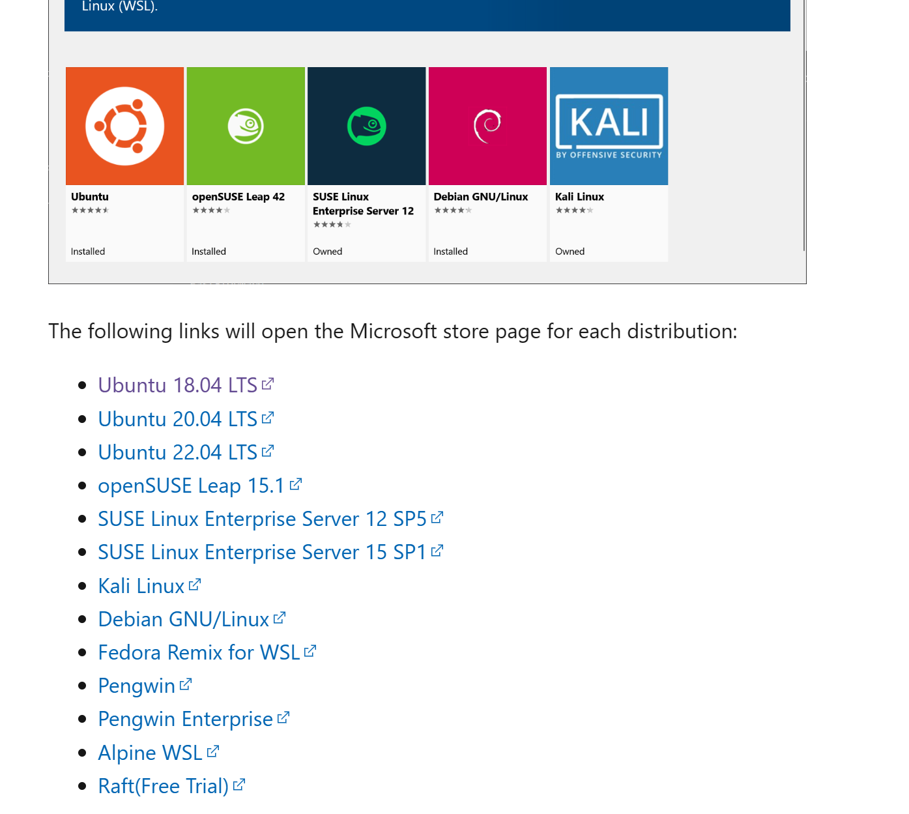

+++
title= "Lxrunoffline：一款自定义安装wsl的工具"
description= "文章简介"
date= 2023-04-11T19:02:39+08:00
author= "chao"
draft= false
image= "" 
math= true
categories= ["app"]

tags=  [" "," "]

+++

文章来源：[(100条消息) 使用 LxRunOffline 实现 WSL 自定义安装、备份_farer_yyh的博客-CSDN博客](https://blog.csdn.net/farer_yyh/article/details/113785474?ops_request_misc=&request_id=&biz_id=102&utm_term=lxrunoffline&utm_medium=distribute.pc_search_result.none-task-blog-2~all~sobaiduweb~default-0-113785474.142^v82^control,201^v4^add_ask,239^v2^insert_chatgpt&spm=1018.2226.3001.4187)


如果你没有使用过 WSL ，首先以管理员身份运行 Pow­er­Shell (WIN+X , A)，输入下面的命令开启 “适用于 Linux 的 Win­dows 子系统” 功能，并重启计算机。

~~~
Enable-WindowsOptionalFeature -Online -FeatureName Microsoft-Windows-Subsystem-Linux
~~~


下载 [WSL 官方离线包](https://docs.microsoft.com/en-us/windows/wsl/install-manual)，你会得到一个后缀为`.appx`的文件，改后缀名为`.zip`，解压后文件夹中会有名为 `install.tar.gz` 的文件。

输入以下命令进行安装：

```bash
lxrunoffline i -n <WSL名称> -d <安装路径> -f <安装包路径>.tar.gz
```

常用命令

~~~
//已经安装的WSL
LxRunOffline.exe list 
//还原WSL
LxRunOffline.exe install -n <wsl_name> -d <res_path> -f <back_path>
//卸载WSL
LxRunOffline.exe uninstall -n <wsl_name>
//备份WSL
LxRunOffline.exe export -n <wsl_name> -f <back_path>
//启动一个WSL
LxRunOffline.exe run -n <wslname>
~~~

创建一个新用户

~~~
 useradd chao -p chao -m -G wheel（或sudo） -s /bin/bash -c "2021-6-3 create 'chao' username " 
 
 passwd chao
 
 lxrunoffline su -n <WSL名称> -v 1000(UID)
~~~


