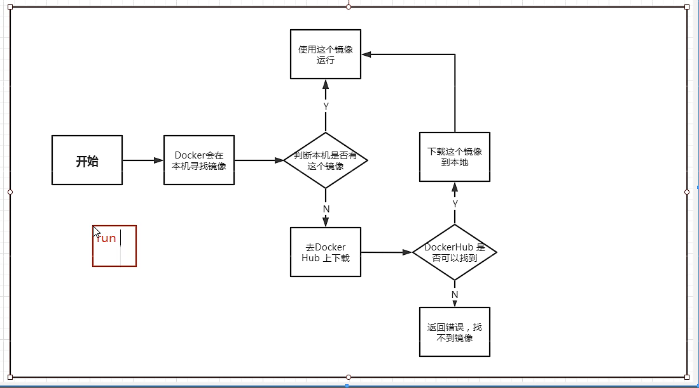

+++
title= "Docker常用命令"
description= "docker"
date= 2022-05-15T01:12:54+08:00
author= "chao"
draft= false
image= "" 
math= true
categories= [
    "app"
]

tags=  [
    " docker"
]

+++

# docker常用命令

## 1.命令图

## 2.docker run流程

