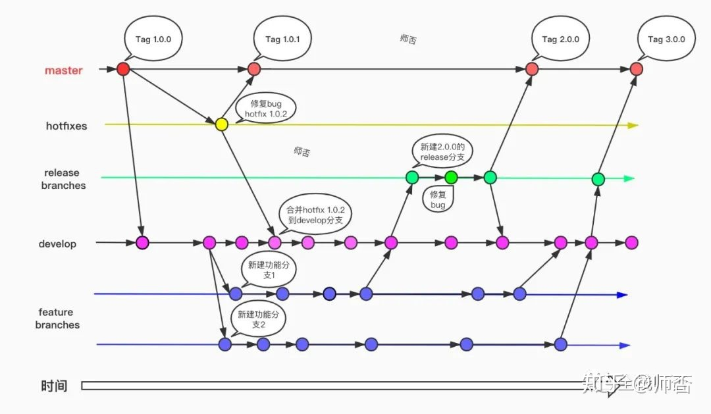
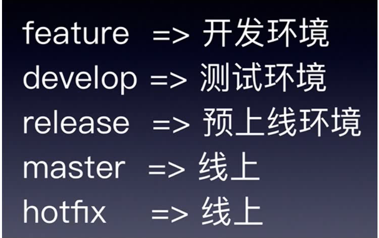

+++
title= "Gitflow"
description= "gitflow"
date= 2022-05-15T13:10:26+08:00
author= "chao"
draft= false
image= "" 
math= true
categories= [
    "app"
]

tags=  [
    " git"
]

+++

# gitflow

参考文档：

[图解git flow开发流程 - 知乎 (zhihu.com)](https://zhuanlan.zhihu.com/p/198066289)

 

