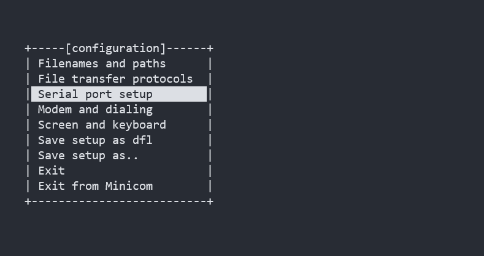
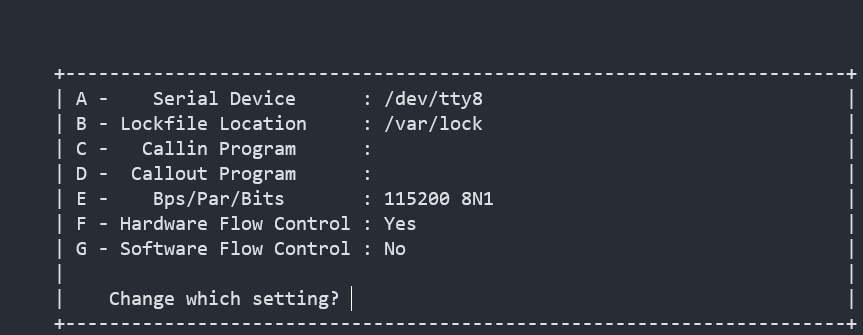
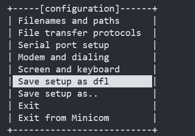
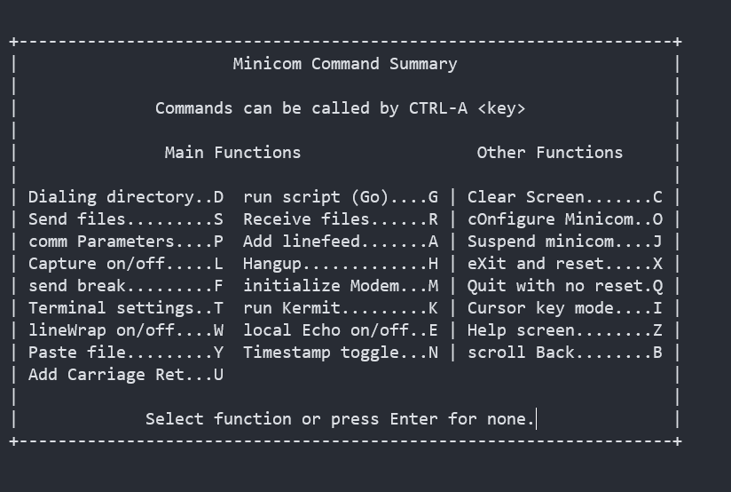

+++
title= "Minicom：linux下一款好用的串口调试工具"
description= "文章简介"
date= 2023-04-08T23:55:03+08:00
author= "chao"
draft= true
image= "" 
math= true
categories= ["app"]

tags=  [" linux"," "]

+++

一、minicom的使用说明

~~~
Usage: minicom [OPTION]... [configuration]
A terminal program for Linux and other unix-like systems.

  -b, --baudrate         : set baudrate (ignore the value from config)
  -D, --device           : set device name (ignore the value from config)
  -s, --setup            : enter setup mode
  -o, --noinit           : do not initialize modem & lockfiles at startup
  -m, --metakey          : use meta or alt key for commands
  -M, --metakey8         : use 8bit meta key for commands
  -l, --ansi             : literal; assume screen uses non IBM-PC character set
  -L, --iso              : don't assume screen uses ISO8859
  -w, --wrap             : Linewrap on
  -H, --displayhex       : display output in hex
  -z, --statline         : try to use terminal's status line
  -7, --7bit             : force 7bit mode
  -8, --8bit             : force 8bit mode
  -c, --color=on/off     : ANSI style color usage on or off
  -a, --attrib=on/off    : use reverse or highlight attributes on or off
  -t, --term=TERM        : override TERM environment variable
  -S, --script=SCRIPT    : run SCRIPT at startup
  -d, --dial=ENTRY       : dial ENTRY from the dialing directory
  -p, --ptty=TTYP        : connect to pseudo terminal
  -C, --capturefile=FILE : start capturing to FILE
  -F, --statlinefmt      : format of status line
  -R, --remotecharset    : character set of communication partner
  -v, --version          : output version information and exit
  -h, --help             : show help
  configuration          : configuration file to use

These options can also be specified in the MINICOM environment variable.
This variable is currently unset.
The configuration directory for the access file and the configurations
is compiled to /etc/minicom.
~~~

# 二、使用案例

## 1.基本使用

进入设置模式

~~~
sudo minicom -s
~~~

选择“ Serial port setup”

配置串口

设置为默认配置，然后退出

打开minicom

~~~
sudo minicom
~~~

退出minicom

~~~
先一起按下“ctrl+a”，再按下KEY
ctrl+a <key> 

e.t.c
ctrl+a z 帮助信息
ctrl+a x 退出
~~~

