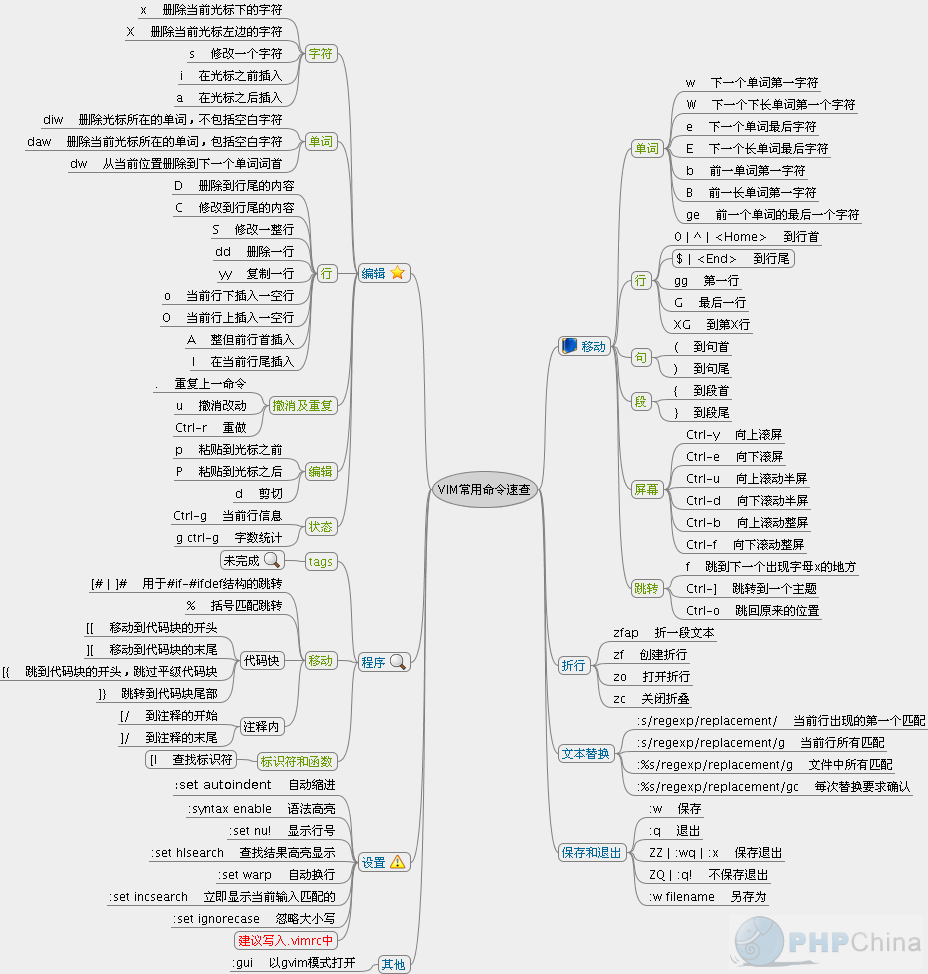

+++
title= "neovim：一款vim的编辑器"
description= "文章简介"
date= 2022-09-12T04:17:39+08:00
author= "chao"
draft= false
image= "" 
math= true
categories= [
    "app"
]

tags=  [
    " vim"
]

+++

# vim常用指令

## 窗口命令

新建横向窗口

~~~
:sp
~~~

新建纵向窗口

~~~
:vs
~~~

切换窗口

~~~
ctrl+w w 
ctrl+w h j k l
ctrl+w t(左上) b(右下)
~~~

窗口移动

~~~

ctrl+w H 最左端
ctrl+w L 最右端
ctrl+w J 最低端
ctrl+w K 最高端
ctrl+w r 顺时针
ctrl+w R 逆时针
ctrl+w x 左右上下对应位置的窗口 对调
~~~

调整窗口高度

~~~
:resize 20 | +20 | -20
:vert resize 20 | +20 | -20
~~~

关闭窗口

~~~
ctrl+w  q(quit), c(close), o(other)
~~~

目录浏览

~~~
:He!(上分屏)
:He(下分屏)
:Ve!
:Ve

~~~

## Tab标签页

~~~
:Te (tab标签)

:tabnew 增加一个标签

:tabc       关闭当前的tab

:tabo       关闭所有其他的tab

:tabs       查看所有打开的tab :tabp 或gT 前一个

:tabn 或gt  后一个 新建标签页

:tabe 在新标签页中打开指定的文件。

:tabnew 在新标签页中编辑新的文件。

:tab split 在新标签页中，打开当前缓冲区中的文件。

:tabf 允许你在当前目录搜索文件，并在新标签页中打开

Vim默认最多只能打开10个标签页。你可以用set tabpagemax=15改变这个限制。
~~~

## 代码自动补全指令

当前项

~~~
ctrl+y  
~~~

上一项

~~~
ctrl+p
~~~

下一项

~~~
ctrl+n
~~~

保持当前文字输入，并退出补全

~~~
ctrl+e
~~~

## 终端命令

终端窗口

~~~
:term bash

:term (cmd)
~~~

终端命令

~~~
:!commond
eg:
:!gcc -v
~~~

# neovim插件配置

## 前提: proxy网络代理

### 1.WSL1

~~~
nano ~/.bashrc

###############PROXY####################
export WIN11_IP=127.0.0.1
export all_proxy="socks5://${WIN11_IP}:7890"
~~~

### 2.wsl2

~~~
nano ~/.bashrc

###############PROXY####################
export WIN11_IP=$(cat /etc/resolv.conf |grep "nameserver" |cut -f 2 -d " ")
export all_proxy="socks5://${WIN11_IP}:7890"
~~~

### 3. VM

~~~
nano ~/.bashrc

###############PROXY####################
export WIN11_IP=windowsIP
export all_proxy="socks5://${WIN11_IP}:7890"
~~~

**测试**

~~~
curl www.google.com
~~~

## 插件

### 1.packer.nvim

~~~
##下载插件
git clone --depth 1 https://github.com/wbthomason/packer.nvim\
 ~/.local/share/nvim/site/pack/packer/start/require("plugins").nvim
~~~

修改~/.config/nvim/init.lua 

~~~
nvim ~/.config/nvim/init.lua
添加
require("plugins")
~~~

修改~/.config/nvim/lua/plugins.lua

~~~
nvim ~/.config/nvim/lua/plugins.lua
~~~

添加如下内容

~~~
-- This file can be loaded by calling `lua require('plugins')` from your init.vim

-- Only required if you have packer configured as `opt`
vim.cmd [[packadd packer.nvim]]

return require('packer').startup(function(use)
  -- packer.nvim插件包管理
  use 'wbthomason/packer.nvim'

end)
~~~

nvim打开任意文件，在command模式下输入(更新插件)

~~~
:PackerSync
~~~

### 2.air-line

~~~
  use {
        "vim-airline/vim-airline",
        requires = {
          "vim-airline/vim-airline-themes",
          --综合图标支持such vim-airline lightline, vim-startify
          "ryanoasis/vim-devicons"
        }
  }
~~~

### 3.主题

#### 3.1 gruvbox

#### [gruvbox地址](https://github.com/ellisonleao/gruvbox.nvim)

~~~
    -- gruvbox theme
    use {
        "ellisonleao/gruvbox.nvim",
        requires = {"rktjmp/lush.nvim"}
    }
~~~

### 4.nvim-tree

~~~
   use {
        'kyazdani42/nvim-tree.lua',
        requires = 'kyazdani42/nvim-web-devicons'
    }
~~~

### 5.bufferline

~~~
-- bufferline
use {'akinsho/bufferline.nvim', requires = 'kyazdani42/nvim-web-devicons'}
~~~

