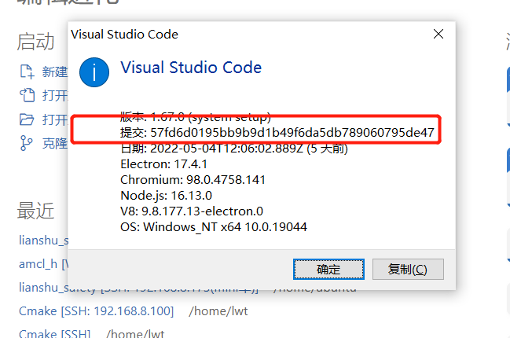
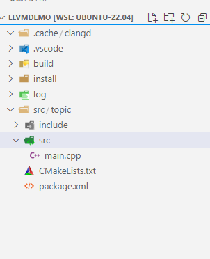

+++
title= "VScode：一款多插件多功能的编辑器"
description= "文章简介"
date= 2022-05-29T10:45:50+08:00
author= "somebody"
draft= true
image= "" 
math= true
categories= [
    "app"
]

tags=  [
    " vscode"
]

+++

# 一、.vscode的配置

## 1. c_cpp_properties.json

ctrl+shift+p ,运行`C/Cpp: Edit configurations...`

~~~json

{
    "configurations": [
        {
            "name": "linux",
            "includePath": [
                "/opt/ros/melodic/include",
                "/usr/include",
                "${workspaceFolder}/**",
                "${workspaceFolder}/devel/include"
            ],
            "intelliSenseMode": "linux-gcc-x64",
            "compilerPath": "/usr/bin/gcc",
            "cppStandard": "c++17",
            "cStandard": "c17"
        }
    ],
    "version": 4
}
~~~

## 2. tasks.json

ctrl+shift+p ,运行task

~~~json
{
    // See https://go.microsoft.com/fwlink/?LinkId=733558
    // for the documentation about the tasks.json format
    "version": "2.0.0",
    "tasks": [
        /*1. mkdir build*/
        {
            "label": "mkdir build",
            "type": "shell",
            "command": "mkdir",
            "args": [
                "-p",
                "build"
            ],
            "options": {"cwd": "${workspaceFolder}"},
            "group": "build",
        },
        /*2. cmake ..*/
        {
            "label": "cmake ..",
            "type": "shell",
            "command": "cmake",
            "args": [
                ".."
            ],
            "options": {
                "cwd": "${workspaceFolder}/build",
                },
            "group": "build",
            "dependsOn":[
                "mkdir build",//表示在"创建build"任务结束后进行
            ]
        },
        /*3. make */
        {
            "label": "make",
            "type": "shell",
            "command": "make",
            "args": [
                ""
            ],
            "group": "build",
            "dependsOn":[
                "cmake ..",//表示在"创建build"任务结束后进行
            ],
            "presentation": {//配置用于显示任务输出并读取其输入的面板
                "echo": true,
                "reveal": "never",
                "focus": false,
                "panel": "shared",
                "showReuseMessage": true,
                "clear": false
            },
            "options": {"cwd": "${workspaceFolder}/build"},
        }
    ]
}
~~~

预定义变量名字

~~~
${workspaceFolder} - 当前工作目录(根目录)
${workspaceFolderBasename} - 当前文件的父目录
${file} - 当前打开的文件名(完整路径)
${relativeFile} - 当前根目录到当前打开文件的相对路径(包括文件名)
${relativeFileDirname} - 当前根目录到当前打开文件的相对路径(不包括文件名)
${fileBasename} - 当前打开的文件名(包括扩展名)
${fileBasenameNoExtension} - 当前打开的文件名(不包括扩展名)
${fileDirname} - 当前打开文件的目录
${fileExtname} - 当前打开文件的扩展名
${cwd} - 启动时task工作的目录
${lineNumber} - 当前激活文件所选行
${selectedText} - 当前激活文件中所选择的文本
${execPath} - vscode执行文件所在的目录
${defaultBuildTask} - 默认编译任务(build task)的名字
~~~

## 3.快捷键

### **vs code 的常用快捷键**

**1、注释**：

　　a) 单行注释：[ctrl+k,ctrl+c] 或 ctrl+/

　　b) 取消单行注释：[ctrl+k,ctrl+u] (按下ctrl不放，再按k + u)

　　c) 多行注释：[alt+shift+A]

　　d) 多行注释：/**

**2、移动行**：alt+up/down

**3、显示/隐藏左侧目录栏** ctrl + b

**4、复制当前行**：shift + alt +up/down

**5、删除当前行**：shift + ctrl + k

**6、控制台终端显示与隐藏**：ctrl + ~

**7、查找文件/安装vs code** **插件地址**：ctrl + p

**8、代码格式化**：shift + alt +f

**9、新建一个窗口** : ctrl + shift + n

**10、行增加缩进:** ctrl + [

**11、行减少缩进:** ctrl + ]

**12、裁剪尾随空格(去掉一行的末尾那些没用的空格)** : ctrl + shift + x

**13、字体放大/缩小:** ctrl + ( + 或 - )

**14、拆分编辑器 :** ctrl + 1/2/3

**15、切换窗口** : ctrl + shift + left/right

**16、关闭编辑器窗口** : ctrl + w

**17、关闭所有窗口 :** ctrl + k + w

**18、切换全屏 :** F11

**19、自动换行** : alt + z

**20、显示git** : ctrl + shift + g

**21、全局查找文件：**ctrl + shift + f

**22、显示相关插件的命令(如：git log)**：ctrl + shift + p

**23、选中文字**：shift + left / right / up / down

**24、折叠代码**： ctrl + k + 0-9 (0是完全折叠)

**25、展开代码**： ctrl + k + j (完全展开代码)

**26、删除行** ： ctrl + shift + k

**27、快速切换主题**：ctrl + k / ctrl + t

**28、快速回到顶部** ： ctrl + home

**29、快速回到底部** : ctrl + end

**30、格式化选定代码** ：ctrl + k / ctrl +f

**31、选中代码 ：** shift + 鼠标左键

**32、多行同时添加内容（光标） ：**ctrl + alt + up/down

**33、全局替换：**ctrl + shift + h

**34、当前文件替换：**ctrl + h

**35、打开最近打开的文件：**ctrl + r

**36、打开新的命令窗：**ctrl + shift + c

### **vs code 的常用插件**

**1、Auto Rename Tag** 修改html标签，自动帮你完成尾部闭合标签的同步修改，和webstorm一样。

**2、Auto Close Tag** 自动闭合HTML标签

**4、Beautiful** 格式化代码的工具

**5、Dash** Dash是MacOS的API文档浏览器和代码段管理器

**6、Ejs Snippets** ejs 代码提示

**7、ESLint** 检查javascript语法错误与提示

**8、File Navigator** 快速查找文件

**9、Git History(git log)** 查看git log

**10、Gulp Snippets** 写gulp时用到，gulp语法提示。

**11、HTML CSS Support** 在HTML标签上写class智能提示当前项目所支持的样式

**12、HTML Snippets** 超级好用且初级的H5代码片段以及提示

**13、Debug for Chrome** 让vs code映射chrome的debug功能，静态页面都可以用vscode来打断点调试、配饰稍微复杂一点

**14、Document this** Js的注释模板

**15、jQuery Code Snippets** jquery提示工具

**16、Html2jade** html模板转pug模板

**17、JS-CSS-HTML Formatter** 格式化

**18、Npm intellisense** require 时的包提示工具

**19、Open in browser** 打开默认浏览器

**20、One Dark Theme** 一个vs code的主题

**21、Path Intellisense** 自动路径补全、默认不带这个功能

**22、Project Manager** 多个项目之间快速切换的工具

**23、Pug(Jade) snippets** pug语法提示

**24、React Components** 根据文件名创建反应组件代码。

**25、React Native Tools** reactNative工具类为React Native项目提供了开发环境。

**26、Stylelint** css/sass代码审查

**27、Typings auto installer** 安装vscode 的代码提示依赖库，基于typtings的

**28、View In Browser** 默认浏览器查看HTML文件（快捷键Ctrl+F1可以修改）

**29、Vscode-icons** 让vscode资源目录加上图标、必备

**30、VueHelper** Vue2代码段（包括Vue2 api、vue-router2、vuex2）

**31、Vue 2 Snippets** vue必备vue代码提示

**32、Vue-color** vue语法高亮主题

**33、Auto-Open Markdown Preview** markdown文件自动开启预览

**34、EverMonkey** 印象笔记

**35、atom one dark** atom的一个高亮主题(个人推荐)

**三、常用的电脑快捷键**

**1、ctrl + shift + delete** 快速清除浏览器缓存

**2、ctrl + alt + delete** 快速进入任务管理器页面

**3、window + L** 快速锁定电脑

**4、window + d** 所有窗口最小化

**5、 window + e** 打开我的资源管理器(我的电脑)

**6、 window + f** 快速打开搜索窗口

**7、 alt + tab** 快速查看打开的应用与窗口

# 二、离线使用remote ssh

参考链接

[VS Code Server的离线安装过程 - 知乎 (zhihu.com)](https://zhuanlan.zhihu.com/p/294933020?msclkid=9372469cd01e11ec850ccb3fcb70049b)

## 准备工作

1  确定vscode的commit id

点击帮助-->关于

2 观察并记录commit id 号

版本: 1.67.0 (system setup)
提交: 57fd6d0195bb9b9d1b49f6da5db789060795de47
日期: 2022-05-04T12:06:02.889Z
Electron: 17.4.1
Chromium: 98.0.4758.141
Node.js: 16.13.0
V8: 9.8.177.13-electron.0
OS: Windows_NT x64 10.0.19044

3 下载远程连接机器的安装包

~~~shell
用2中的内容替换${commit id}
#arm64
https://update.code.visualstudio.com/commit:${commit id}/server-linux-arm64/stable

#x64
https://update.code.visualstudio.com/commit:${commit id}/server-linux-x64/stable

#armhf
https://update.code.visualstudio.com/commit:${commit id}/server-linux-armhf/stable
~~~

## 安装工作

1 进入要连接的机器上，创建文件夹

~~~shell
mkdir -p $HOME/.vscode-server/bin
~~~

2 将下载包拷贝进$HOME/.vscode-server/bin目录下

3 解压

~~~shell
cd $HOME/.vscode-server/bin

tar -zxvf vscode-server-linux-armhf.tar.gz

rm -rf vscode-server-linux-armhf.tar.gz
~~~

4 重命名

~~~shell
mv vscode-server-linux-armhf ${commit id}

替换为具体的id

mv vscode-server-linux-armhf 57fd6d0195bb9b9d1b49f6da5db789060795de47
~~~

5 改权限

~~~shell
cd $HOME/.vscode-server/bin

chmod -R 775 ${commit id}
即
chmod -R 775 57fd6d0195bb9b9d1b49f6da5db789060795de47
~~~

6 连接

使用vscode远程连接

## other

如果需要插件，找到一个类似的机器，在上面联网安装，安装后的插件在$HOME/.vscode-server/extensions下，直接打包拷贝到离线机器人相同目录就可以了。

用win上的拷贝也可以

# 三、clangd--智能提示

以ubuntu为例，需要先在ubuntu中安装

~~~
sudo apt install llvm clangd lldb
~~~

clang：前端编译器，将二进制码转换为IR码

llvm：后端虚拟机，将IR码转换为机器码

clangd：语言服务器的一种

lldb：调试器

再在打开vscode，下载两款插件 clangd  和 codelldb

### 3.1 clangd 代码自动补全

clangd插件会自动提示你安装clangd

生成compile_commands.json

> 1. 普通cmake编译：CMakeLists.txt
>
>     set(CMAKE_EXPORT_COMPILE_COMMANDS ON)
>
> 2. ROS编译指令：**`catkin_make -DCMAKE_EXPORT_COMPILE_COMMANDS=1`**

### 3.2 codeLLDB代码调试

其中CodeLLDB可能会下载不成功，可以从vsix安装

# 四、vscode-icons--图标显示

# 五、NeoVim--编辑器

在wsl中下载neovim

~~~
sudo apt install neovim
~~~

修改neovim插件的配置

