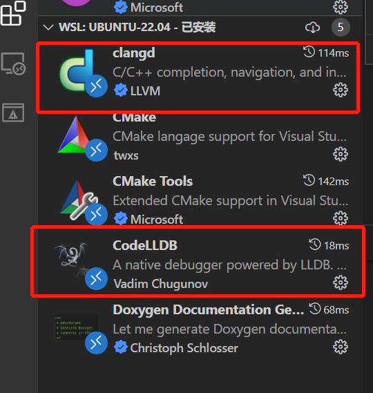
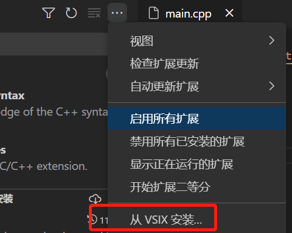

+++
title= "个人插件配置"
description= "vscode中,个人常用的插件配置"
date= 2022-09-01T14:07:53+08:00
author= "chao"
draft= false
image= "" 
math= true
categories= [
    "app"
]

tags=  [
    " tool"
]

+++

# vscode 插件使用

## clangd--智能提示

以ubuntu为例，需要先在ubuntu中安装

~~~
sudo apt install llvm clangd lldb
~~~

再在打开vscode，下载两款插件 clangd  和 codelldb

其中CodeLLDB可能会下载不成功，可以从vsix安装

## vscode-icons--图标显示

# NeoVim--编辑器

在wsl中下载neovim

~~~
sudo apt install neovim
~~~

修改neovim插件的配置

