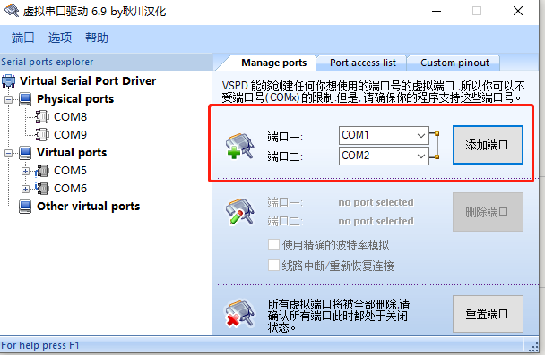
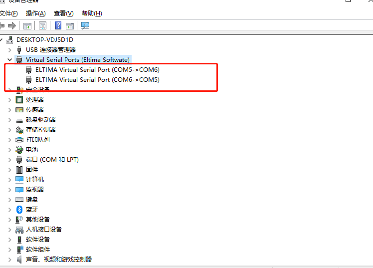
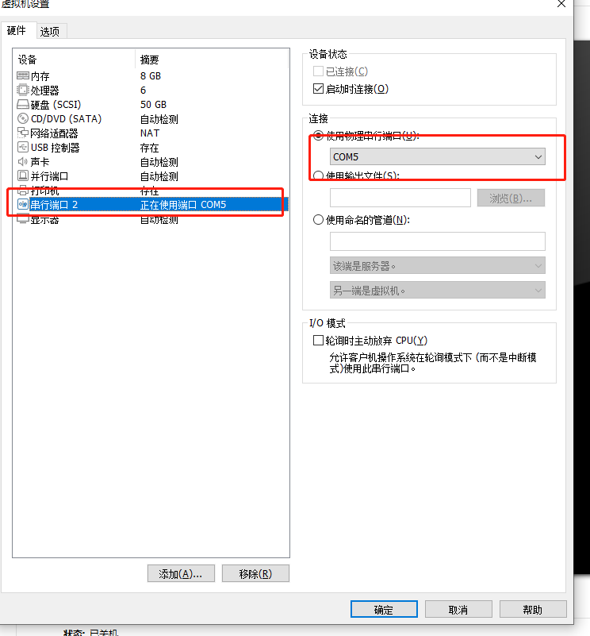

+++
title= "vspd&VM"
description= "使用vspd配置VM的虚拟机的串口调试"
date= 2022-04-19T15:57:41+08:00
author= "somebody"
draft= true
image= "" 
math= true
categories= [
    "app"
]

tags=  [
    " project"
]

+++

# 使用vspd配置VM的虚拟机的串口调试

## 下载vspd

> 链接：https://pan.baidu.com/s/15sQ3B3Ty4QGH8Rvl7yFz0g 
> 提取码：kjdw

## 创建虚拟串口

## VM绑定相应的串口

> note:
>
> 1. 将windows的串口com5绑定到linux的串口/dev/ttyS1上
>2. 如果Vm没有检测到虚拟串口，请关闭vm，重启vm
> 3. ***图片中的"串行端口n"，实际对应linux系统中/dev/ttyS(n-1)***

