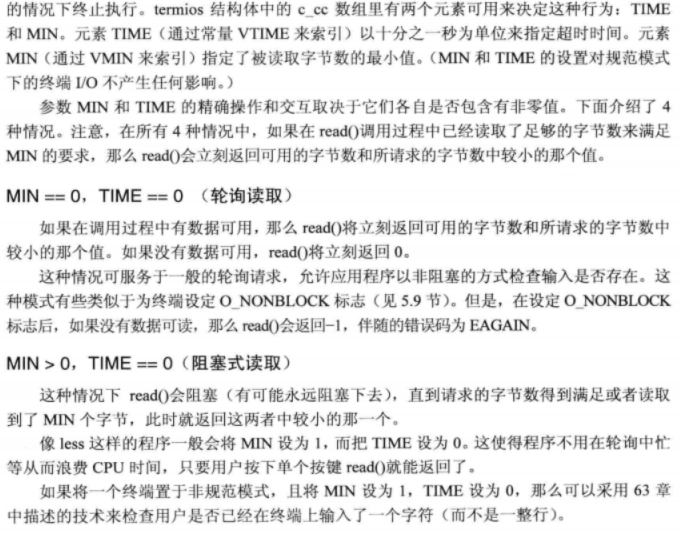
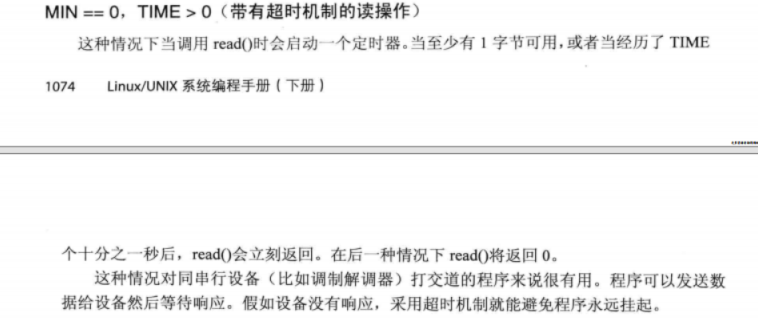
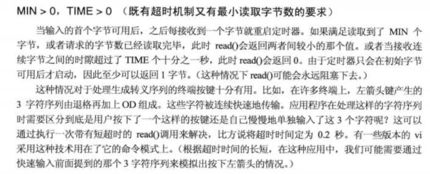

+++
title= "Linux串口编程"
description= "linux串口编程一些总结（本文为linux串口编程中的raw模式）"
date= 2022-04-26T17:51:22+08:00
author= "chao"
draft= false
image= "" 
math= true
categories= [
    "lang"
]

tags=  [
    " c","project ","linux"
]

+++

# LINUX串口编程--raw

## 参考blog

[ linux-串口应用编程_邻居家的小南瓜的博客-CSDN博客](https://blog.csdn.net/qq_37932504/article/details/121125906?ops_request_misc=&request_id=&biz_id=102&utm_term=linux 串口api&utm_medium=distribute.pc_search_result.none-task-blog-2~all~sobaiduweb~default-4-121125906.142^v9^pc_search_result_control_group,157^v4^new_style&spm=1018.2226.3001.4187)

## 案例代码

[click here]([code/02c/uart at main · Getonechao/code (github.com)](https://github.com/Getonechao/code/tree/main/02c/uart))

## API总结

###### <termios.h>

~~~c
/* Return the output baud rate stored in *TERMIOS_P.  */
extern speed_t cfgetospeed (const struct termios *__termios_p) __THROW;

/* Return the input baud rate stored in *TERMIOS_P.  */
extern speed_t cfgetispeed (const struct termios *__termios_p) __THROW;

/* Set the output baud rate stored in *TERMIOS_P to SPEED.  */
extern int cfsetospeed (struct termios *__termios_p, speed_t __speed) __THROW;

/* Set the input baud rate stored in *TERMIOS_P to SPEED.  */
extern int cfsetispeed (struct termios *__termios_p, speed_t __speed) __THROW;

#ifdef	__USE_MISC
/* Set both the input and output baud rates in *TERMIOS_OP to SPEED.  */
extern int cfsetspeed (struct termios *__termios_p, speed_t __speed) __THROW;
#endif


/* Put the state of FD into *TERMIOS_P.  */
extern int tcgetattr (int __fd, struct termios *__termios_p) __THROW;

/* Set the state of FD to *TERMIOS_P.
   Values for OPTIONAL_ACTIONS (TCSA*) are in <bits/termios.h>.  */
extern int tcsetattr (int __fd, int __optional_actions,
		      const struct termios *__termios_p) __THROW;


#ifdef	__USE_MISC
/* Set *TERMIOS_P to indicate raw mode.  */
extern void cfmakeraw (struct termios *__termios_p) __THROW;
#endif

/* Send zero bits on FD.  */
extern int tcsendbreak (int __fd, int __duration) __THROW;

/* Wait for pending output to be written on FD.

   This function is a cancellation point and therefore not marked with
   __THROW.  */
extern int tcdrain (int __fd);

/* Flush pending data on FD.
   Values for QUEUE_SELECTOR (TC{I,O,IO}FLUSH) are in <bits/termios.h>.  */
extern int tcflush (int __fd, int __queue_selector) __THROW;

/* Suspend or restart transmission on FD.
   Values for ACTION (TC[IO]{OFF,ON}) are in <bits/termios.h>.  */
extern int tcflow (int __fd, int __action) __THROW;


#if defined __USE_XOPEN_EXTENDED || defined __USE_XOPEN2K8
/* Get process group ID for session leader for controlling terminal FD.  */
extern __pid_t tcgetsid (int __fd) __THROW;
#endif
~~~

###### open()函数

~~~
int open (const char *__path, int __oflag, ...)
~~~


###### tcgetattr()函数

功能：获取终端的属性

返回值：返回值：调用成功时返回 0；失败将返回-1

~~~c
#include <termios.h>
int tcgetattr(int fd, struct termios *termios_p);
~~~

###### tcsetattr()函数

功能：修改终端的属性

返回值：返回值：调用成功时返回 0；失败将返回-1

~~~c
#include <termios.h>
int tcsetattr(int fd, int optional_actions,const struct termios *termios_p);
~~~

> note：optional_actions--更改何时生效
>
> |               |                                                      |
> | ------------- | ---------------------------------------------------- |
> | **TCSANOW**   | **配置立即生效**                                     |
> | **TCSADRAIN** | **配置在所有写入 fd 的输出都传输完毕之后生效**       |
> | **TCSAFLUSH** | **所有已接收但未读取的输入都将在配置生效之前被丢弃** |

###### cfmakeraw()函数

功能：将终端配置为原始模式。

~~~c
void cfmakeraw(struct termios *termios_p);
~~~

###### 波特率设置

~~~c

//获取输入输出波特率
extern speed_t cfgetospeed (const struct termios *__termios_p) __THROW;
extern speed_t cfgetispeed (const struct termios *__termios_p) __THROW;
//修改输入输出波特率
extern int cfsetospeed (struct termios *__termios_p, speed_t __speed) __THROW;
extern int cfsetispeed (struct termios *__termios_p, speed_t __speed) __THROW;
//同时修改输入输出波特率
extern int cfsetspeed (struct termios *__termios_p, speed_t __speed) __THROW;

~~~

###### tcdrain()函数

功能：调用 tcdrain()函数后会使得应用程序阻塞， 直到串口输出缓冲区中的数据全部发送完毕为止

返回值：调用成功时返回 0；失败将返回-1，

~~~c
#include <termios.h> 
int tcdrain(int fd);
~~~

###### tcflush()函数

功能：调用该函数会清空输入/输出缓冲区中的数据

返回值：返回值：调用成功时返回 0；失败将返回-1

~~~c
#include <termios.h>
int tcflush(int fd, int queue_selector);
~~~

> note:queue_selector
>
> | **TCIFLUSH**  | **对接收到而未被读取的数据进行清空处理**  |
> | ------------- | ----------------------------------------- |
> | **TCOFLUSH**  | **对尚未传输成功的输出数据进行清空处理**  |
> | **TCIOFLUSH** | **对尚未处理的输入/输出数据进行清空处理** |

###### tcflow()函数

功能：调用 tcflow()函数会暂停数据传输或接收工作。

返回值：返回值：调用成功时返回 0；失败将返回-1。

~~~c++
#include <termios.h>

int tcflow(int fd, int action);
~~~

> note: action
>
> |            |                                                       |
> | ---------- | ----------------------------------------------------- |
> | **TCOOFF** | **暂停数据输出（输出传输）**                          |
> | **TCOON**  | **重新启动暂停的输出**                                |
> | **TCIOFF** | **发送 STOP 字符，停止终端设备向系统发送数据**        |
> | **TCION**  | **发送一个 START 字符，启动终端设备向系统发送数据；** |

## struct termios结构体

```cpp
struct termios
{
    tcflag_t c_iflag; /* input mode flags */
    tcflag_t c_oflag; /* output mode flags */
    tcflag_t c_cflag; /* control mode flags */
    tcflag_t c_lflag; /* local mode flags */
    cc_t c_line; /* line discipline */
    cc_t c_cc[NCCS]; /* control characters */
    speed_t c_ispeed; /* input speed */
    speed_t c_ospeed; /* output speed */
};
```

###### 波特率、数据位、停止位使用案例

~~~c++

    /*0. 保存原有的termios*/
    tcgetattr(this->fd, &old_termios);

    /*1. 设置波特率 */
    new_termios.c_cflag&=~CBAUD;//波特率掩码(000000010017 /*  baud speed mask)
    if(cfsetispeed(&(new_termios),baud_adapt(baudrate))<0)
    {
        std::cerr<<"[err]:function cfsetispeed()--set "<< baudrate<<" input baudrate failed!!!\n";
        this->uart_close();
        return -1;
    }
    if(cfsetospeed(&(new_termios),baud_adapt(baudrate))<0)
    {
        std::cerr<<"[err]:function cfsetospeed()--set "<< baudrate<<" output baudrate failed!!!\n";
        this->uart_close();
        return -1;
    }

    /* 2.设置数据位 */
    new_termios.c_cflag&=~CSIZE;//屏蔽其他标志
    switch (databits)//设置数据位
    {
    case 5:
        new_termios.c_cflag|=CS5;
        break;
    case 6:
        new_termios.c_cflag|=CS6;
        break;
    case 7:
        new_termios.c_cflag|=CS7;
        break;
    case 8:
        new_termios.c_cflag|=CS8;
        break;
    default:
        this->uart_close();
        std::cerr<<"[err]:set databits failed!!!\n";
        return -1;
        break;
    }
    
    /*3. 设置奇偶检验 */

    switch (parity)
    {
    case 'N'://无
        new_termios.c_iflag &= ~(INPCK | ISTRIP);//关闭输入奇偶检验检查
        new_termios.c_cflag &= ~PARENB;//关闭奇偶位
        break;
    case 'E'://奇
        new_termios.c_iflag |= (INPCK | ISTRIP);//开启输入奇偶检验检查
        new_termios.c_cflag |= PARENB;//开启奇偶位
        new_termios.c_cflag &= ~PARODD;//关闭偶位
        break;
    case 'O'://偶
        new_termios.c_iflag |= (INPCK | ISTRIP);//开启输入奇偶检验检查
        new_termios.c_cflag|= PARENB;//开启奇偶位
        new_termios.c_cflag |= PARODD;//开启偶位
        break;
    default:
        this->uart_close();
        std::cerr<<"[err]:set parity failed!!!\n";
        return -1;
        break;
    }

    /*4. 设置停止位 */
    switch (stopbits)
    {
    case 1:
        new_termios.c_cflag &= ~CSTOPB;
        break;
    case 2:
        new_termios.c_cflag |= CSTOPB;//每个字符使用2bit停止位，否者就使用一个
        break;
    default:
        this->uart_close();
        break;
    }

    /*5. 设置非规范模式(即raw模式)，也可以使用cfmakeraw()函数*/
    new_termios.c_lflag &= ~(ICANON | ECHO | ECHOE | ISIG);
	new_termios.c_oflag &=~ OPOST; /* Raw output */
    new_termios.c_cc[VMIN]=0;
    new_termios.c_cc[VTIME]=1;

    /*6.other*/
    new_termios.c_iflag &= ~(IXON | IXOFF | IXANY);/* Software flow control is disabled */
    
    /*7.设置生效 */
    if(tcsetattr(this->fd,TCSANOW,&(new_termios))<0)
    {
        std::cerr<<"[err]:function tcsetattr()--set attr failed!!!\n";
        this->uart_close();
        return -1;
    }
~~~

###### 非规范模式：C_CC[]--MIN TIME





