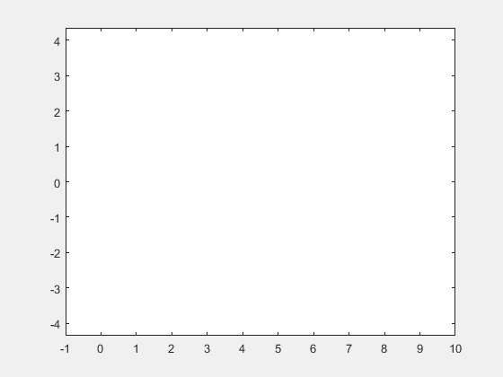

+++
title= "画图"
description= "matlab中一些画图技巧"
date= 2022-04-18T21:17:05+08:00
author= "chao"
draft= true
image= "" 
math= true
categories= [
    "lang"
]

tags=  [
    " matlab"
]

+++

# Matlab中一些画图方式

## 符号表达式画图

|                                                              |                                        |
| ------------------------------------------------------------ | -------------------------------------- |
| [`fimplicit`](https://ww2.mathworks.cn/help/symbolic/fimplicit.html) | 隐函数                                 |
| [`fimplicit3`](https://ww2.mathworks.cn/help/symbolic/fimplicit3.html) | Plot 3-D implicit equation or function |
| [`fmesh`](https://ww2.mathworks.cn/help/symbolic/fmesh.html) | Plot 3-D mesh                          |
| [`fplot`](https://ww2.mathworks.cn/help/symbolic/fplot.html) | 一般式、参数方程                       |
| [`fplot3`](https://ww2.mathworks.cn/help/symbolic/fplot3.html) | Plot 3-D parametric curve              |
| [`fsurf`](https://ww2.mathworks.cn/help/symbolic/fsurf.html) | Plot 3-D surface                       |
| [`ezpolar`](https://ww2.mathworks.cn/help/symbolic/ezpolar.html) | 极坐标                                 |
| [`fcontour`](https://ww2.mathworks.cn/help/symbolic/fcontour.html) | 3维，等高线                            |

例子

~~~matlab
 figure(1);
 syms f(t);
 f=5*exp(-0.8*t)*sin(pi*t);
 fplot(f,[0,5]);
~~~

## 符号表达式动画

|                                                              |                                                              |
| ------------------------------------------------------------ | ------------------------------------------------------------ |
| [`fanimator`](https://ww2.mathworks.cn/help/symbolic/fanimator.html) | Create stop-motion animation object(创造动画对象)            |
| [`playAnimation`](https://ww2.mathworks.cn/help/symbolic/playanimation.html) | Play animation objects in a MATLAB figure window(播放)       |
| [`rewindAnimation`](https://ww2.mathworks.cn/help/symbolic/rewindanimation.html) | Rewind previously played animation objects（回放）           |
| [`writeAnimation`](https://ww2.mathworks.cn/help/symbolic/writeanimation.html) | Save animation as video file(保存)                           |
| [`animationToFrame`](https://ww2.mathworks.cn/help/symbolic/animationtoframe.html) | Return structure of frames from animation objects（用一个数组存储每一帧） |

例子

~~~
syms y(x) t;
figure(1);
y=sin(x);
fanimator(@fplot,x,y,[0 t],"FrameRate",2)%帧率为2
axis equal %xy轴相等
playAnimation(figure(4),'AnimationRange',[0 15]);%t的取值范围定为[0 15]
writeAnimation('wheel.gif')%保存为GIF
~~~

