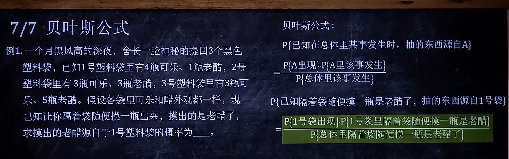
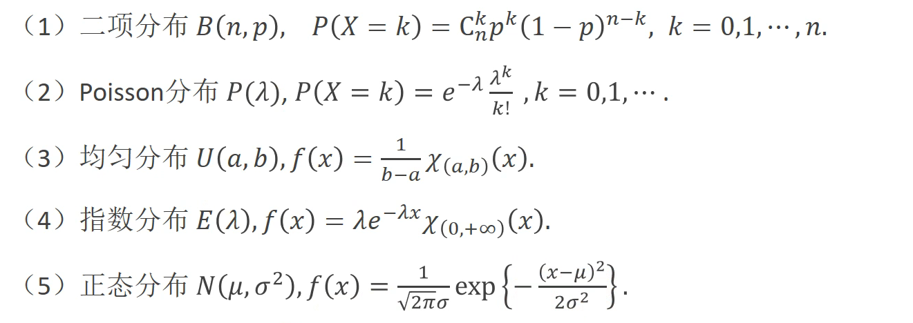

+++
title= "概率论学习之旅1"
description= "概率论与数理统计"
date= 2022-04-01T20:47:41+08:00
author= "somebody"
draft= false
image= "" 
math= true
categories= [
    "math"
]

tags=  [
    "概率论"
]
+++

# 概率论与数理统计 

## 古典概型
 
1. 试验中所有可能出现的基本事件只有有限个
2. 试验中每个基本事件出现的可能性相等。

具有以上两个特点的概率模型是大量存在的，这种概率模型称为古典概率模型，简称古典概型，也叫**等可能概型** 
********
## 几何概型：
1. 无限性：试验中所有可能出现的基本事件（结果）有无限多个.
2. 等可能性：每个基本事件出现的可能性相等.

&emsp;&emsp;如果每个事件发生的概率只与构成该事件区域的长度(面积或体积或度数)成比例，则称这样的概率模型为几何概率模型，简称为几何概型。**古典概型与几何概型的主要区别在于：几何概型是另一类等可能概型，它与古典概型的区别在于试验的结果是无限个**。

********
## 全概率公式

********
## 贝叶斯公式
$$
P(A|B)=\frac{P(B|A)P(A)}{P(B)} 
$$
贝叶斯公式用来描述两个条件概率之间的关系。即通常，事件A在事件B(发生)的条件下的概率，与事件B在事件A的条件下的概率是不一样的；然而，这两者是有确定的关系,贝叶斯法则就是这种关系的陈述。

在贝叶斯法则中，每个名词都有约定俗成的名称：
1. P(A)是A的先验概率或边缘概率。之所以称为"先验"是因为它不考虑任何B方面的因素。
2. P(A|B)是已知B发生后A的条件概率，也由于得自B的取值而被称作A的后验概率。
3. P(B|A)是已知A发生后B的条件概率，也由于得自A的取值而被称作B的后验概率。
4. P(B)是B的先验概率或边缘概率，也作标准化常量（normalized constant）。
   
按这些术语，Bayes法则可表述为：  
&emsp;&emsp;**后验概率 = (似然度 * 先验概率)/标准化常量**   
&emsp;&emsp;也就是说，后验概率与先验概率和似然度的乘积成正比。  
&emsp;&emsp;另外，比例Pr(B|A)/Pr(B)也有时被称作标准似然度（standardised likelihood），Bayes法则可表述为：
后验概率 = 标准似然度 * 先验概率。 [1] 

  
 1.可测空间

 2.常用的一维分布  
 

[链接](../../激光有反/index.html)