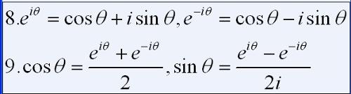
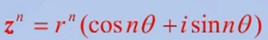

+++
title= "《信号与系统》读书笔记2"
description= "文章简介"
date= 2022-04-18T09:19:39+08:00
author= "somebody"
draft= true
image= "" 
math= true
categories= [
    "math"
]

tags=  [
]

+++

# 周期信号的傅里叶级数表示

## 知识回顾

###### 欧拉公式

复分析的欧拉公式特例

假设$z=r(cos(\theta )+ isin(\theta))$

###### 复数的乘除公式

$$Z_{1}Z_{2}=(r_{1}r_{2})(cos(ArgZ_{1}+Arg Z_{2})+isin(ArgZ_{1}+ArgZ_{2}))$$

$$\frac{Z_{1}}{Z_{2}}=(\frac{r_{1}}{r_{2}} )(cos(ArgZ_{1}-Arg Z_{2})+isin(ArgZ_{1}-ArgZ_{2}))$$

###### 复数的乘幂公式

