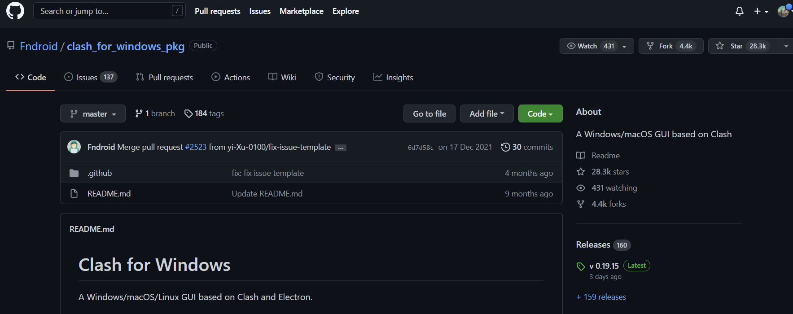
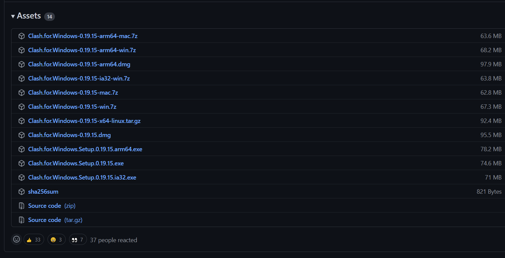
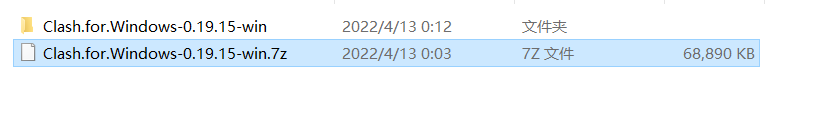
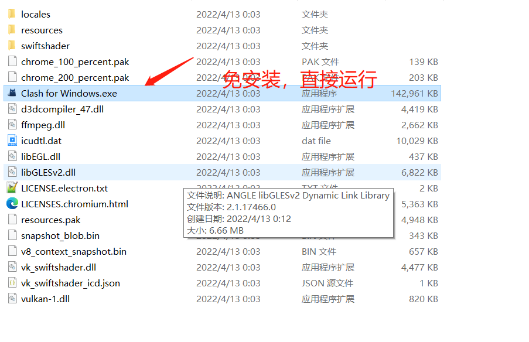
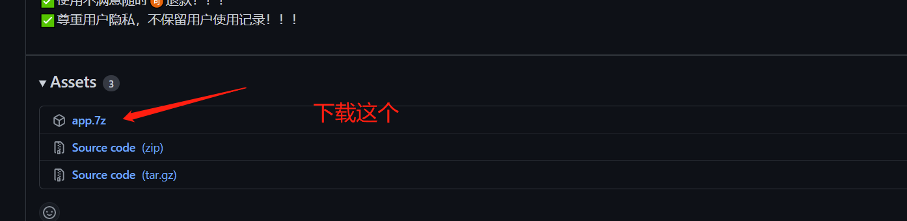
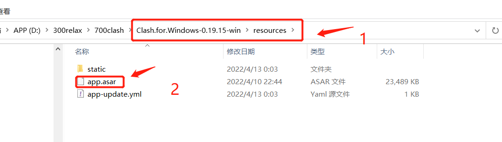
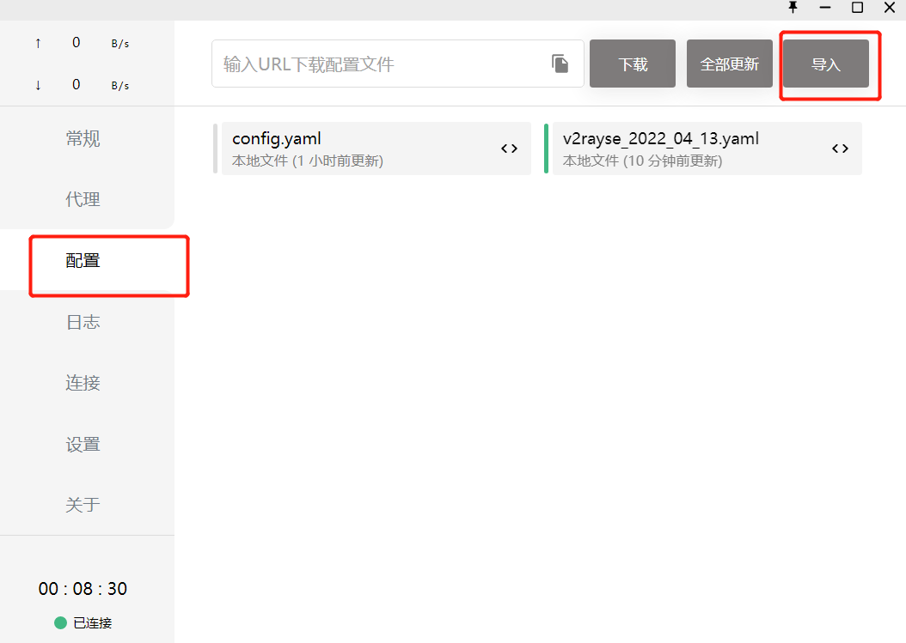
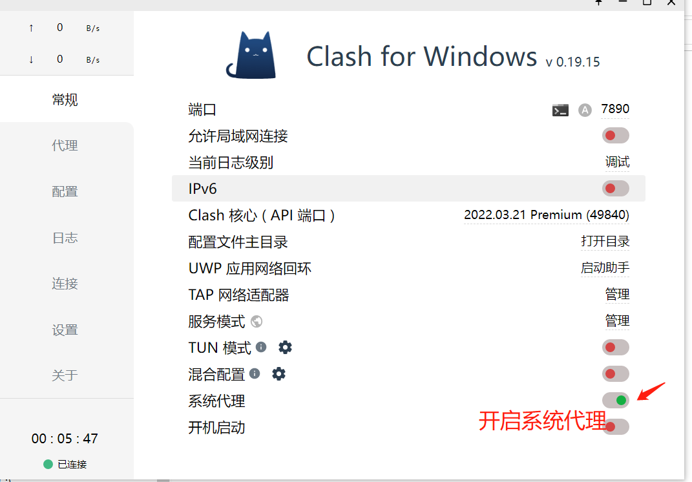
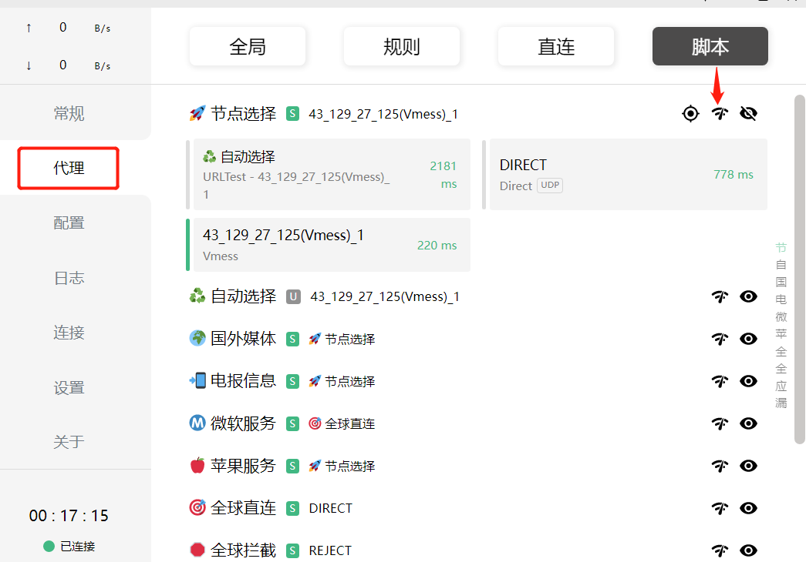

+++
title= "安装clash"
description= "win10安装clash"
date= 2022-04-12T23:56:53+08:00
author= "chao"
draft= false
image= "" 
math= true
categories= [
    "net"
]

tags=  [
    "win10"
]
+++
# win10安装clash

## 1.下载
clash for win软件是一个开源项目，被开源在github上，它是具有windows,mac,linux(x86和arm)多版本的gui软件。  
[点击跳转：开源地址](https://github.com/Fndroid/clash_for_windows_pkg)

由于github的网站位于国外，可能打不开，下载地址如下：  
[点击下载：clash下载地址](https://github.com/Fndroid/clash_for_windows_pkg/releases/download/0.19.15/Clash.for.Windows-0.19.15-win.7z)

## 2.安装
解压软件包

 
软件包是安装的，可以直接运行

 

## 3.汉化
由于软件是国外开发的，所以gui界面文字是英语，我们需要将它汉化。
汉化教程在github上开源的  

[点击跳转：开源地址](https://github.com/BoyceLig/Clash_Chinese_Patch)

[点击下载：汉化包下载地址](https://github.com/BoyceLig/Clash_Chinese_Patch/releases/download/0.19.15/app.7z)

 
解压汉化包，得到一个app.asar文件，用汉化包中的app.asar替换resources/app.asar
  
 
启动clash

## 4.节点导入

导入yaml配置文件

### 4.1 在线转换 

v2ray转换到clash,将vmess协议转换为yaml配置文件在线小工具
[点击跳转](https://v2rayse.com/v2ray-clash)  
由于是纯前端的转换工具，所以加载可能有点慢，耐心等待一下
转换完成后，下载yaml文件，然后见上图，导入yaml文件    
 

### 4.2 自己配置yaml文件模板

​	Clash支持SS、V2ray和trojan协议

[深入理解Clash配置文件 - VPS攻略 (vpsgongyi.com)](https://vpsgongyi.com/p/2396/)

*****

开启系统代理

检测网络是否通

 
 

 大功告成！！！