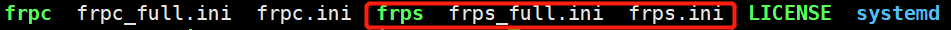

+++
title= "内网穿透"
description= "frp内网穿透"
date= 2022-05-07T09:20:36+08:00
author= "chao"
draft= false
image= "" 
math= true
categories= [
    "os"
]

tags=  [
    " linux","app"
]

+++

# 内网穿透

## 1. frp解决方案

## 1.1 下载

~~~shell
wget https://github.com/fatedier/frp/releases/download/v0.42.0/frp_0.42.0_linux_arm.tar.gz

tar -zxvf frp_0.42.0_linux_arm.tar.gz
~~~

## 1.2 server配置

​	  **note：联塑项目：车体控制程序是服务端**

进入程序目录

~~~bash
cd frp_0.42.0_linux_arm
~~~

图中红线部分是server程序及其配置文件

修改权限

~~~
chmod 755 frpc frps
~~~

配置文件

~~~shell
nano frps.ini
~~~
写入如下内容
~~~shell
[common]
bind_port = 7000
~~~

## 1.3 client配置

**note：联塑项目：ros是客户端**

进入程序目录

~~~shell
cd frp_0.42.0_linux_arm
~~~
修改权限

~~~
chmod 755 frpc frps
~~~

图中红线部分是client程序及其配置文件

配置文件

~~~shell
nano frpc.ini
~~~

写入如下内容

~~~shell

[common]
server_addr = 192.168.8.147
server_port = 7000

[ssh]
type = tcp
local_ip = 192.168.100.10
local_port = 22
remote_port = 10022
~~~

## 1.4 测试

1. ###### 打开server端，即车体控制程序板子

   ~~~shell
   ./frps
   ~~~

2. ###### 打开client端，即ros程序板子

   ~~~shell
   ./frpc
   ~~~

3. ###### 打开本地电脑终端

   ~~~shell
   ssh -oPort=10022 pi@192.168.8.147
   ~~~
   

## 1.5 开机自启动

###### 树莓派

~~~
sudo nano /etc/rc.local

在"exit 0"前添加脚本
su pi -c "bash ~/start/Mystart.sh &"

~~~

创建脚本

~~~
mkdir $HOME/start && cd $HOME/start && touch Mystart.sh

chmod 755 Mystart.sh
~~~

脚本内容

~~~shell
#!/bin/bash
su pi -c "exec ~/frp/frps >/dev/null &"
~~~

###### ubuntu

~~~shell
cd  /etc/init.d && sudo nano Mystart.sh
~~~
脚本内容
~~~shell
#!/bin/bash
su ubuntu -c "exec ~/frp/frpc >/dev/null &"
~~~
给与启动权限
~~~shell
sudo chmod 775 Mystart.sh
sudo update-rc.d  Mystart.sh  defaults 90
~~~
删除启动权限
~~~
sudo update-rc.d -f   Mystart.sh  remove
~~~

