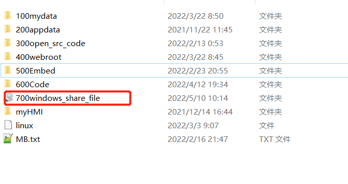
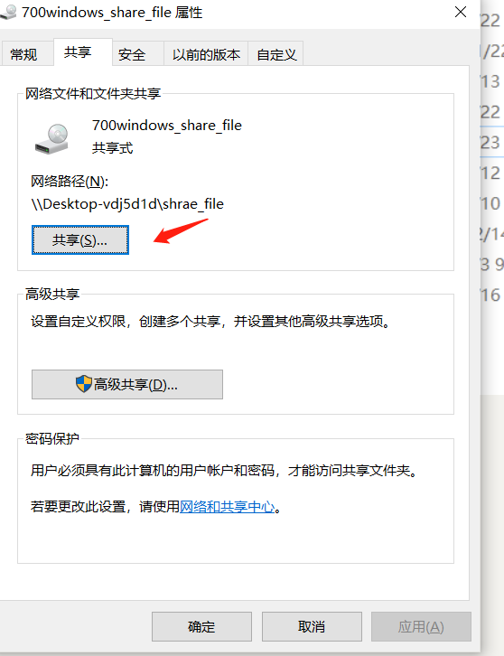
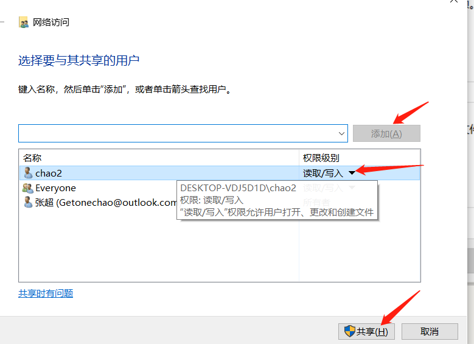
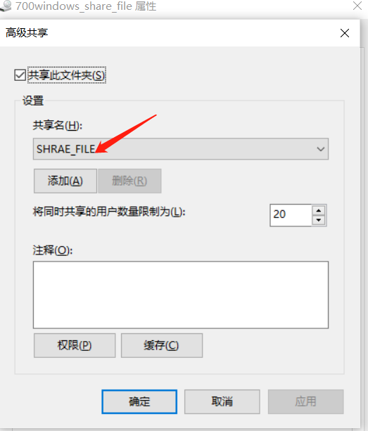
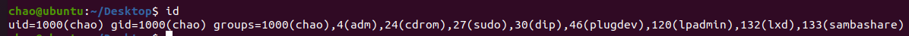

+++
title= "Mount挂载"
description= "文章简介"
date= 2022-05-09T16:28:55+08:00
author= "somebody"
draft= true
image= "" 
math= true
categories= [
    "os"
]

tags=  [
    "linux"," tool"
]

+++

# Mount挂载

## mount网络挂载

##  1 win10上新建一个文件夹

修改属性，设置共享

如果不确定win10的用户名和密码，就新建一个本地用户

## 2 linux挂载命令

查看当前linux用户id

~~~shell
id 
~~~

挂载

~~~shell
sudo mount -t cifs -o username=chao2,password=88888888zc! -o rw,uid=1000,gid=1000  //192.168.209.1/shrae_file /home/chao/Desktop/mountpoint
~~~

