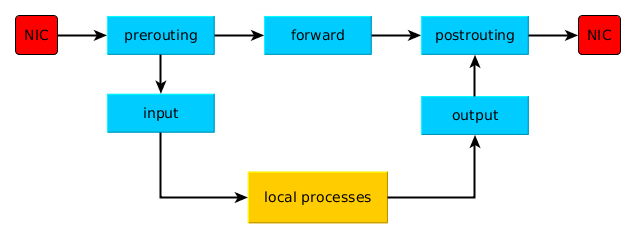
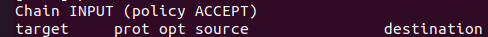

+++
title= "Netfilter"
description= "iptables的工具的使用"
date= 2022-05-09T08:41:54+08:00
author= "chao"
draft= false
image= "" 
math= true
categories= [
    "os"
]

tags=  [
    " linux","net","tool"
]

+++

# netfilter

## 相关网址

[官网：netfilter/iptables project homepage](https://www.netfilter.org/?msclkid=0db22671cf3111ec9ba387055fbccddc)

[ iptables基础知识详解_LarryHai6的博客-CSDN博客_iptables](https://blog.csdn.net/u011537073/article/details/82685586?ops_request_misc=%7B%22request%5Fid%22%3A%22165205748016782246468350%22%2C%22scm%22%3A%2220140713.130102334..%22%7D&request_id=165205748016782246468350&biz_id=0&utm_medium=distribute.pc_search_result.none-task-blog-2~all~sobaiduend~default-2-82685586-null-null.142^v9^pc_search_result_control_group,157^v4^new_style&utm_term=iptables&spm=1018.2226.3001.4187)

[使用iptables进行端口转发 - 云+社区 - 腾讯云 (tencent.com)](https://cloud.tencent.com/developer/article/1852188?msclkid=41295a1ecf3511eca9683df4a822fe74)

## 原理图




## iptables

##### 1. 原理叙述

iptables具有Filter, NAT, Mangle, Raw四种内建表：

**1. Filter表**

Filter表示iptables的默认表，因此如果你没有自定义表，那么就默认使用filter表，它具有以下三种内建链：

- **INPUT链** – 处理来自外部的数据。
- **OUTPUT链** – 处理向外发送的数据。
- **FORWARD链** – 将数据转发到本机的其他网卡设备上。

**2. NAT表**

NAT表有三种内建链：

- **PREROUTING链** – 处理刚到达本机并在路由转发前的数据包。它会转换数据包中的目标IP地址（destination ip address），通常用于DNAT(destination NAT)。
- **POSTROUTING链** – 处理即将离开本机的数据包。它会转换数据包中的源IP地址（source ip address），通常用于SNAT（source NAT）。
- **OUTPUT链** – 处理本机产生的数据包。

**3. Mangle表**

Mangle表用于指定如何处理数据包。它能改变TCP头中的QoS位。Mangle表具有5个内建链：

- PREROUTING
- OUTPUT
- FORWARD
- INPUT
- POSTROUTING

**4. Raw表**

Raw表用于处理异常，它具有2个内建链：

- PREROUTING chain
- OUTPUT chain

##### 2. 命令使用

显示表内容

~~~sh
 sudo iptables -t filter –L  
~~~



- num – 指定链中的规则编号
- target – 前面提到的target的特殊值
  - **ACCEPT** – 允许防火墙接收数据包
  - **DROP** – 防火墙丢弃包
  - **QUEUE** – 防火墙将数据包移交到用户空间
  - **RETURN** – 防火墙停止执行当前链中的后续Rules，并返回到调用链(the calling chain)中。
- prot – 协议：tcp, udp, icmp等
- source – 数据包的源IP地址
- destination – 数据包的目标IP地址


清空表

~~~shell
iptables -t NAT -F
~~~

添加规则

~~~shell
iptables -t 表名 <-A/I/D/R> 规则链名 [规则号] <-i/o 网卡名> -p 协议名 <-s 源IP/源子网> --sport 源端口 <-d 目标IP/目标子网> --dport 目标端口 -j 动作
~~~

##### 3.  特定场景

###### 端口映射

~~~shell
sudo nano /etc/sysctl.conf


net.ipv4.ip_forward=0 改为 net.ipv4.ip_forward=1

生效
sudo sysctl -p


~~~

添加规则

~~~shell
iptables -t nat -A PREROUTING -p tcp --dport [端口号] -j DNAT --to-destination [目标IP]
iptables -t nat -A PREROUTING -p udp --dport [端口号] -j DNAT --to-destination [目标IP]
iptables -t nat -A POSTROUTING -p tcp -d [目标IP] --dport [端口号] -j SNAT --to-source [本地服务器IP]
iptables -t nat -A POSTROUTING -p udp -d [目标IP] --dport [端口号] -j SNAT --to-source [本地服务器IP]

将本地(内网:192.168.20.3 外网:192.168.8.101)10022端口映射到192.168.20.2:22

sudo iptables -t nat -I PREROUTING -p tcp --dport 10022 -j DNAT --to-destination 192.168.20.2:22
sudo iptables -t nat -I PREROUTING -p udp --dport 10022 -j DNAT --to-destination 192.168.20.2:22

sudo iptables -t nat -I POSTROUTING -p tcp -d 192.168.20.2/24   --dport 22 -j SNAT --to-source 192.168.20.3
sudo iptables -t nat -I POSTROUTING -p udp -d 192.168.20.2/24   --dport 22 -j SNAT --to-source 192.168.20.3

~~~

保存生效

~~~shell
service iptables save
service iptables restart
~~~

永久保存

- 首先安装iptables-persistent工具

```none
sudo apt install iptables-persistent
```

- 每当设置了新的iptables规则后，使用如下命令保存规则即可，规则会根据ipv4和ipv6分别保存在了/etc/iptables/rules.v4和/etc/iptables/rules.v6文件中。

```none
sudo netfilter-persistent  save
```

由于 ipt­a­bles-per­sis­tent 在安装时已经把它作为一个服务设置为开机启动了，它在开机后会自动加载已经保存的规则，所以也就达到了永久保存的目的。其实原理和第一种方法是类似的，只是设置起来会更简单一些。

