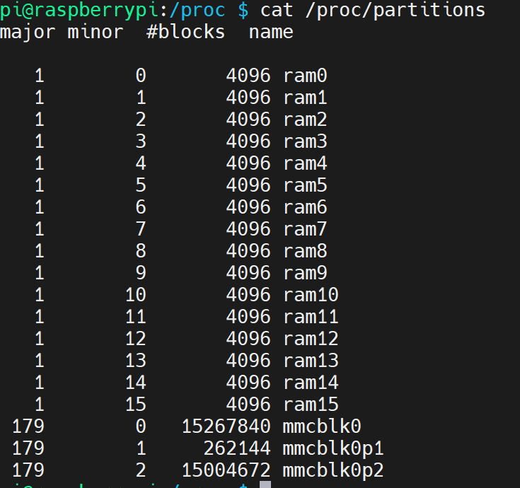

+++
title= "linux：/proc 硬件信息查询"
description= "文章简介"
date= 2023-04-11T09:02:51+08:00
author= "chao"
draft= true
image= "" 
math= true
categories= ["os"]

tags=  [" linux"," "]

+++

# 一、/proc文件系统

## 1.进程相关信息-PID：646

- 进程目录中的此文件不包含任何信息；

  

- cwd — 指向“当前进程运行目录的”一个符号链接；

  

- environ — 当前进程的环境变量列表，彼此间用空字符（NULL）隔开；变量用大写字母表示，其值用小写字母表示； 

  

- exe — 指向启动当前进程的可执行文件（完整路径）的符号链接，通过/proc/N/exe可以启动当前进程的一个拷贝；

  

- fd — 这是个目录，包含当前进程打开的每一个文件的文件描述符（file descriptor），这些文件描述符是指向实际文件的一个符号链接；

  

- limits — 当前进程所使用的每一个受限资源的软限制、硬限制和管理单元；此文件仅可由实际启动当前进程的UID用户读取；（2.6.24以后的内核版本支持此功能）；

  

- maps — 当前进程关联到的每个可执行文件和库文件在内存中的映射区域及其访问权限所组成的列表；

  

- mem — 当前进程所占用的内存空间，由open、read和lseek等系统调用使用，不能被用户读取；

- root — 指向当前进程运行根目录的符号链接；在Unix和Linux系统上，通常采用chroot命令使每个进程运行于独立的根目录；

- stat — 当前进程的状态信息，包含一系统格式化后的数据列，可读性差，通常由ps命令使用；

- statm — 当前进程占用内存的状态信息，通常以“页面”（page）表示； 

- status — 与stat所提供信息类似，但可读性较好，如下所示，每行表示一个属性信息；其详细介绍请参见 proc的man手册页；

  

- task — 目录文件，包含由当前进程所运行的每一个线程的相关信息，每个线程的相关信息文件均保存在一个由线程号（tid）命名的目录中，这类似于其内容类似于每个进程目录中的内容；（内核2.6版本以后支持此功能） 

## 2./proc/devices 

系统已经加载的所有块设备和字符设备的信息，包含主设备号和设备组（与主设备号对应的设备类型）名

## 3./proc/diskstats

 

## 4./proc/dma 

每个正在使用且注册的ISA DMA通道的信息列表

## 5./proc/execdomains

内核当前支持的执行域（每种操作系统独特“个性”）信息列表；  

## 6./proc/fb 

帧缓冲设备列表文件，包含帧缓冲设备的设备号和相关驱动信息；

## 7./proc/filesystems 

当前被内核支持的文件系统类型列表文件，被标示为nodev的文件系统表示不需要块设备的支持；

通常mount一个设备时，如果没有指定文件系统类型将通过此文件来决定其所需文件系统的类型；

## 8./proc/interrupts 

X86或X86_64体系架构系统上每个IRQ相关的中断号列表；

多路处理器平台上每个CPU对于每个I/O设备均有自己的中断号； 

## 9. /proc/iomem 

每个物理设备上的记忆体（RAM或者ROM）在系统内存中的映射信息；

## 10./proc/ioports 

当前正在使用且已经注册过的与物理设备进行通讯的输入-输出端口范围信息列表；如下面所示，第一列表示注册的I/O端口范围，其后表示相关的设备； 

## 11./proc/kallsyms 

模块管理工具用来动态链接或绑定可装载模块的符号定义，由内核输出；（内核2.5.71以后的版本支持此功能）；通常这个文件中的信息量相当大； 

## 12./proc/kcore 

系统使用的物理内存，以ELF核心文件（core file）格式存储，其文件大小为已使用的物理内存（RAM）加上4KB；

这个文件用来**检查内核数据结构的当前状态**，因此，通常由**GBD通常调试工具**使用，但不能使用文件查看命令打开此文件；

## 13./proc/kmsg 

此文件用来**保存由内核输出的信息**，通常由**/sbin/klogd或/bin/dmsg**等程序使用，不要试图使用查看命令打开此文件；

## 14./proc/loadavg 

保存关于CPU和磁盘I/O的负载平均值，其前三列分别表示每1秒钟、每5秒钟及每15秒的负载平均值，类似于uptime命令输出的相关信息；第四列是由斜线隔开的两个数值，前者表示当前正由内核调度的实体（进程和线程）的数目，后者表示系统当前存活的内核调度实体的数目；第五列表示此文件被查看前最近一个由内核创建的进程的PID；

## 15./proc/locks 

保存当前由内核锁定的文件的相关信息，包含内核内部的调试数据；每个锁定占据一行，且具有一个惟一的编号；如下输出信息中每行的第二列表示当前锁定使用的锁定类别，POSIX表示目前较新类型的文件锁，由lockf系统调用产生，FLOCK是传统的UNIX文件锁，由flock系统调用产生；第三列也通常由两种类型，ADVISORY表示不允许其他用户锁定此文件，但允许读取，MANDATORY表示此文件锁定期间不允许其他用户任何形式的访问；

## 16./proc/mdstat 

保存RAID相关的多块磁盘的当前状态信息，在没有使用RAID机器上，其显示为如下状态

## 17./proc/meminfo 

系统中关于当前内存的利用状况等的信息，常由free命令使用；可以使用文件查看命令直接读取此文件，其内容显示为两列，前者为统计属性，后者为对应的值；

## 18./proc/mounts 

在内核2.4.29版本以前，此文件的内容为系统当前挂载的所有文件系统，在2.4.19以后的内核中引进了每个进程使用独立挂载名称空间的方式，此文件则随之变成了指向/proc/self/mounts（每个进程自身挂载名称空间中的所有挂载点列表）文件的符号链接；/proc/self是一个独特的目录，后文中会对此目录进行介绍； 

## 19./proc/modules 

当前装入内核的所有模块名称列表，可以由lsmod命令使用，也可以直接查看；如下所示，

其中第一列表示模块名，

第二列表示此模块占用内存空间大小，

第三列表示此模块有多少实例被装入，

第四列表示此模块依赖于其它哪些模块，

第五列表示此模块的装载状态（Live：已经装入；Loading：正在装入；Unloading：正在卸载），

第六列表示此模块在内核内存（kernel memory）中的偏移量；

## 20./proc/partitions 

块设备每个分区的主设备号（major）和次设备号（minor）等信息，同时包括每个分区所包含的块（block）数目（如下面输出中第三列所示）；

## 21./proc/bus/pci 

内核初始化时发现的所有PCI设备及其配置信息列表，其配置信息多为某PCI设备相关IRQ信息，可读性不高，可以用“/sbin/lspci –vb”命令获得较易理解的相关信息；在2.6内核以后，此文件已为/proc/bus/pci目录及其下的文件代替； 

## 22./proc/slabinfo 

在内核中频繁使用的对象（如inode、dentry等）都有自己的cache，即slab pool，而/proc/slabinfo文件列出了这些对象相关slap的信息；详情可以参见内核文档中slapinfo的手册页；

## 23./proc/stat 

实时追踪自系统上次启动以来的多种统计信息；如下所示，其中， 
“cpu”行后的八个值分别表示以1/100（jiffies）秒为单位的统计值（包括系统运行于用户模式、低优先级用户模式，运系统模式、空闲模式、I/O等待模式的时间等）； 
“intr”行给出中断的信息，第一个为自系统启动以来，发生的所有的中断的次数；然后每个数对应一个特定的中断自系统启动以来所发生的次数； 
“ctxt”给出了自系统启动以来CPU发生的上下文交换的次数。 
“btime”给出了从系统启动到现在为止的时间，单位为秒； 
“processes (total_forks) 自系统启动以来所创建的任务的个数目； 
“procs_running”：当前运行队列的任务的数目； 
“procs_blocked”：当前被阻塞的任务的数目； 

## 24./proc/swaps 

当前系统上的交换分区及其空间利用信息，如果有多个交换分区的话，则会每个交换分区的信息分别存储于/proc/swap目录中的单独文件中，而其优先级数字越低，被使用到的可能性越大；下面是作者系统中只有一个交换分区时的输出信息；

## 25./proc/uptime 

系统上次启动以来的运行时间，如下所示，其第一个数字表示系统运行时间，第二个数字表示系统空闲时间，单位是秒； 

## 26./proc/version 

当前系统运行的内核版本号，在作者的RHEL5.3上还会显示系统安装的gcc版本，如下所示；

## 27./proc/vmstat 

当前系统虚拟内存的多种统计数据，信息量可能会比较大，这因系统而有所不同，可读性较好；下面为作者机器上输出信息的一个片段；（2.6以后的内核支持此文件） 

## 28./proc/zoneinfo 

内存区域（zone）的详细信息列表，信息量较大，下面列出的是一个输出片段： 

## 29./proc/self

pid/来获取指定进程的信息。/proc/pid

如果某个进程想要获取当前进程的系统信息，就可以通过进程的pid来访问/proc/pid/目录,但是这个方法还需要获取进程pid。

如果程序运行中，在fork、daemon等情况下，pid还可能发生变化。

为了更方便的获取本进程的信息，Linux提供了/proc/self/目录，这个目录比较独特，不同的进程访问该目录时获得的信息时不同的，内容等价于/proc/本进程pid/。

进程可以通过访问/proc/self/目录来获取自己的系统信息，而不用每次都获取pid。

# 二、cpu信息

cpu硬件信息

~~~
lscpu

Architecture:        armv7l
Byte Order:          Little Endian
CPU(s):              4
On-line CPU(s) list: 0-3
Thread(s) per core:  1
Core(s) per socket:  4
Socket(s):           1
Vendor ID:           ARM
Model:               3
Model name:          Cortex-A72
Stepping:            r0p3
CPU max MHz:         1500.0000
CPU min MHz:         600.0000
BogoMIPS:            162.00
Flags:               half thumb fastmult vfp edsp neon vfpv3 tls vfpv4 idiva idivt vfpd32 lpae evtstrm crc32
~~~

详细的cpu单核信息

~~~
 cat /proc/cpuinfo
 
 
processor       : 0
model name      : ARMv7 Processor rev 3 (v7l)
BogoMIPS        : 108.00
Features        : half thumb fastmult vfp edsp neon vfpv3 tls vfpv4 idiva idivt vfpd32 lpae evtstrm crc32
CPU implementer : 0x41
CPU architecture: 7
CPU variant     : 0x0
CPU part        : 0xd08
CPU revision    : 3

processor       : 1
model name      : ARMv7 Processor rev 3 (v7l)
BogoMIPS        : 108.00
Features        : half thumb fastmult vfp edsp neon vfpv3 tls vfpv4 idiva idivt vfpd32 lpae evtstrm crc32
CPU implementer : 0x41
CPU architecture: 7
CPU variant     : 0x0
CPU part        : 0xd08
CPU revision    : 3

processor       : 2
model name      : ARMv7 Processor rev 3 (v7l)
BogoMIPS        : 108.00
Features        : half thumb fastmult vfp edsp neon vfpv3 tls vfpv4 idiva idivt vfpd32 lpae evtstrm crc32
CPU implementer : 0x41
CPU architecture: 7
CPU variant     : 0x0
CPU part        : 0xd08
CPU revision    : 3

processor       : 3
model name      : ARMv7 Processor rev 3 (v7l)
BogoMIPS        : 108.00
Features        : half thumb fastmult vfp edsp neon vfpv3 tls vfpv4 idiva idivt vfpd32 lpae evtstrm crc32
CPU implementer : 0x41
CPU architecture: 7
CPU variant     : 0x0
CPU part        : 0xd08
CPU revision    : 3

Hardware        : BCM2711
Revision        : b03140
Serial          : 10000000f5e46c1d
Model           : Raspberry Pi Compute Module 4 Rev 1.0
~~~

# 三、内存信息

查看内存大致信息

~~~
free -m

           total        used        free      shared  buff/cache   available
Mem:          1.8Gi        55Mi       1.7Gi       8.0Mi       119Mi       1.7Gi
Swap:          99Mi          0B        99Mi

DESCRIPTION
       free  displays  the total amount of free and used physical and swap memory in the system, as well as the buffers and caches used by the kernel. The information is gathered by parsing /proc/meminfo. The displayed columns are:

~~~

详细的内存信息

~~~
cat /proc/meminfo
~~~

# 四、磁盘信息

1. 查看硬盘和分区分布

~~~
lsblk

NAME         MAJ:MIN RM  SIZE RO TYPE MOUNTPOINT
mmcblk0      179:0    0 14.6G  0 disk
├─mmcblk0p1  179:1    0  256M  0 part /boot
└─mmcblk0p2  179:2    0 14.3G  0 part /
mmcblk0boot0 179:32   0    4M  1 disk
mmcblk0boot1 179:64   0    4M  1 disk
~~~

2.查看硬盘和分区的详细信息

~~~
fdisk -l
~~~

3.文件夹信息

~~~
sudo du -sh *
~~~

# 五、网卡信息

/proc/net/dev: 我们可以实时获取"网络适配器及统计信息"

这里我们主要关心Receive和Transmit项的bytes项。同样网卡的流量，丢包率可以通过/proc/net/dev文件来读取。 ifstat获取网卡数据就是读取的/proc/net/dev系统来的。

~~~
/proc/net/dev

bytes: 接口发送或接收的数据的总字节数
packets: 接口发送或接收的数据包总数
errs: 由设备驱动程序检测到的发送或接收错误的总数
drop: 设备驱动程序丢弃的数据包总数
fifo: FIFO缓冲区错误的数量
frame: 分组帧错误的数量
colls: 接口上检测到的冲突数
compressed: 设备驱动程序发送或接收的压缩数据包数
carrier: 由设备驱动程序检测到的载波损耗的数量
multicast: 设备驱动程序发送或接收的多播帧数
~~~

