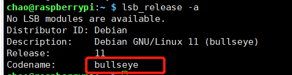

+++
title= "Raspberry：系统初始配置操作"
description= "Raspberry系统初始配置操作"
date= 2022-04-30T13:21:57+08:00
author= "chao"
draft= false
image= "" 
math= true
categories= [
    "os"
]

tags=  [
    "command","raspberry"
]

+++

# Raspberry系统初始配置操作

> note: Raspberry Pi OS从bullseye(2022-04-04 debaian 11)以后不在设置默认用户pi和密码raspberry，建议用官方下载器烧录系统，可以自定义初始化一个用户名和密码。

- 下载器地址：[Raspberry Pi OS – Raspberry Pi](https://www.raspberrypi.com/software/)

- Raspberry Pi OS下载地址：[Operating system images – Raspberry Pi](https://www.raspberrypi.com/software/operating-systems/)

## 1. 网络配置

### 1.1 以太网固定ip地址

~~~shell
sudo nano /etc/dhcpcd.conf
~~~

取消相应的注释

~~~shell
interface wlan0
static ip_address=192.168.1.102/24
static ip6_address=fd51:42f8:caae:d92e::ff/64
static routers=192.168.1.1
static domain_name_servers=192.168.18.1 192.168.1.1 fd51:42f8:caae:d92e::1

interface eth0
static ip_address=192.168.1.181/24
static routers=192.168.1.1
static domain_name_servers=192.168.1.1
~~~

### 1.2 wifi连接

###### 1.2.1 已经进入系统，联网情况下

~~~
//进入配置文件
sudo nano /etc/wpa_supplicant/wpa_supplicant.conf

//添加

network={
ssid="无线名称"

psk="无线密码"

}

~~~

###### 1.2.1 没用进入到系统，boot中配置

boot盘中，新建文件，文件名为wpa_supplicant.conf,写入

~~~shell
country=CN
ctrl_interface=DIR=/var/run/wpa_supplicant GROUP=netdev
update_config=1

network={
ssid="无线名称"
psk="无线密码"
key_mgmt=WPA-PSK
priority=1
}
~~~

同上创建一个名字是ssh的文本文档，什么都不写，开启ssh服务

## 2. 换源

[参考资源—树莓派实验室](https://shumeipai.nxez.com/2013/08/31/raspbian-chinese-software-source.html)

确定树莓派系统版本

~~~
lsb_release -a
~~~

> note:
>
> 树莓派有如下两个架构：
>
> - arm64
> - armhf
>
> 树莓派系统有如下几个版本
>
> - wheezy
> - jessie
> - stretch（Debian 9）
> - buster（Debian 10）
> - bullseye（Debian 11）

可用以下网站替换下面源

中国科学技术大学
Raspbian http://mirrors.ustc.edu.cn/raspbian/raspbian/

阿里云
Raspbian http://mirrors.aliyun.com/raspbian/raspbian/

清华大学
Raspbian http://mirrors.tuna.tsinghua.edu.cn/raspbian/raspbian/

华中科技大学
Raspbian http://mirrors.hustunique.com/raspbian/raspbian/
Arch Linux ARM http://mirrors.hustunique.com/archlinuxarm/

华南农业大学（华南用户）
Raspbian http://mirrors.scau.edu.cn/raspbian/

大连东软信息学院源（北方用户）
Raspbian http://mirrors.neusoft.edu.cn/raspbian/raspbian/

重庆大学源（中西部用户）
Raspbian http://mirrors.cqu.edu.cn/Raspbian/raspbian/

~~中山大学~~ 已跳转至中国科学技术大学源
Raspbian [~~http://mirror.sysu.edu.cn/raspbian/raspbian/~~](http://mirror.sysu.edu.cn/raspbian/raspbian/)

新加坡国立大学
Raspbian http://mirror.nus.edu.sg/raspbian/raspbian

牛津大学
Raspbian http://mirror.ox.ac.uk/sites/archive.raspbian.org/archive/raspbian/

韩国KAIST大学
Raspbian http://ftp.kaist.ac.kr/raspbian/raspbian/

~~~
 sudo nano /etc/apt/sources.list 
~~~

wheezy

~~~
deb http://mirrors.sysu.edu.cn/raspbian/raspbian/ wheezy main contrib non-free
deb-src http://mirrors.sysu.edu.cn/raspbian/raspbian/ wheezy main contrib non-free
~~~

jessie

~~~
deb http://mirrors.sysu.edu.cn/raspbian/raspbian/ jessie main contrib non-free
deb-src http://mirrors.sysu.edu.cn/raspbian/raspbian/ jessie main contrib non-free
~~~

stretch

~~~
deb http://mirrors.sysu.edu.cn/raspbian/raspbian/ stretch main contrib non-free
deb-src http://mirrors.sysu.edu.cn/raspbian/raspbian/ stretch main contrib non-free
~~~

buster

~~~
deb http://mirrors.tuna.tsinghua.edu.cn/raspbian/raspbian/ buster main non-free contrib
deb-src http://mirrors.tuna.tsinghua.edu.cn/raspbian/raspbian/ buster main non-free contrib
~~~

bullseye

~~~

#如果需要 armhf软件源
deb [arch=armhf] http://mirrors.tuna.tsinghua.edu.cn/raspbian/raspbian/ bullseye main non-free contrib rpi
deb-src http://mirrors.tuna.tsinghua.edu.cn/raspbian/raspbian/ bullseye main non-free contrib rpi

# 如果需要 arm64 软件源，在 `/etc/apt/sources.list` 中加上
deb [arch=arm64] http://mirrors.tuna.tsinghua.edu.cn/raspbian/multiarch/ bullseye main
~~~

