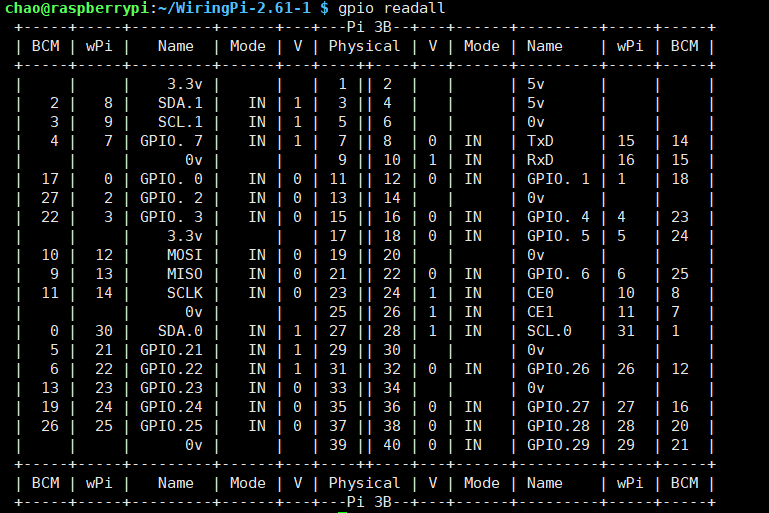

+++
title= "树莓派硬件资料"
description= "40pin、wiringPi"
date= 2022-05-04T11:56:53+08:00
author= "chao"
draft= false
image= "" 
math= true
categories= [
    "os"
]

tags=  [
    "raspberry "
]

+++

# 树莓派硬件资料

# 40pin

- SDA.0、SDA.1：I2C数据传输口
- SCL.0、SCL.1：I2C的时钟信号
- GPIO.x（x = 0,1,2,3,4,5,6,7;21,22,23,24,25,26,27,28,29）:通用的输入输出，自己定义即可
- TXD\RXD: 串口
- MOSI：主输出  从输入(SPI)
- MISO：主输入  从输出(SPI)
- SCLK：SPI通信的时钟线(SPI)
- CE0、CE1：片选信号(SPI)

## WiringPi

[WiringPi](http://wiringpi.com/)

###### 官网介绍截取

1. ***WiringPi*** is a ***PIN*** based GPIO access library written in C for the BCM2835, BCM2836 and BCM2837 SoC devices used in all **Raspberry Pi.** versions. The source code is not publicly available but may be made available to those who wish commercial support.

2. It’s designed to be familiar to people who have used the Arduino “*wiring*” system1 and is intended for use by experienced C/C++ programmers. It is not a newbie learning tool.

   

3. ***WiringPi*** is developed directly on a Raspberry Pi running 32-bit Raspbian.**I do not support any other platform, cross compiling or operating systems.** 

###### 安装

[Raspberry Pi | Wiring | Download & Install | Wiring Pi](http://wiringpi.com/download-and-install/)

> note:如果官网地址打不开，直接下载github中的下载包

install

~~~bash
wget https://github.com/WiringPi/WiringPi/archive/refs/tags/2.61-1.tar.gz

tar zxvf 2.61-1.tar.gz 

cd WiringPi-2.61-1/

./build

OK
~~~

test

~~~shell
gpio -v
~~~

~~~shell
gpio readall
~~~

