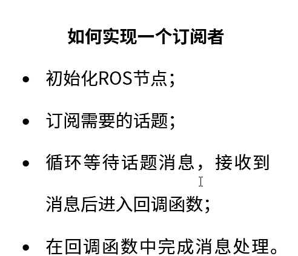
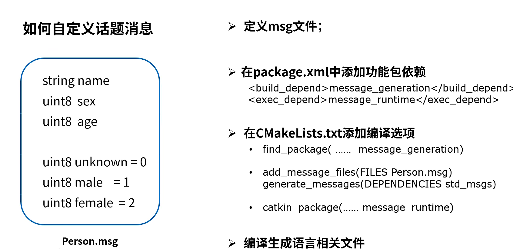

+++
title= "5_ros编程"
description= "topic server"
date= 2022-05-04T16:45:20+08:00
author= "somebody"
draft= true
image= "" 
math= true
categories= [
    "os"
]

tags=  [
    "robat"," ros"
]

+++

# ros编程

## 1.topic

##### 1.1 topic_pulisher程序实现四个步骤

##### 1.2 topic_subscriber程序实现四个步骤

 

> note：保证回调函数中处理不能太长

##### 1.3 话题消息的定义与使用

###### - ----->定义

~~~
#在功能包src/package/,创建msg文件夹
mkdir msg

#编写msg/*.msg

#打开package.xml，添加动态生成程序的依赖
<build_depend>message_generation</build_depend>
<exec_depend>message_runtime</exec_depend>

#CMakeLists.txt添加编译选项
find_package(.....  message_generation)

add_message_files(FILES person.msg)
generate_messages(DEPENDENCIES std_msgs)#person.msg依赖那些库

catkin_package(CATKIN_DEPENDS ... message_runtime)

~~~

******* ********************

######  ------->使用：订阅自定义的消息

[ROS订阅自定义消息_plokm789456的博客-CSDN博客](https://blog.csdn.net/plokm789456/article/details/79290592?ops_request_misc=%7B%22request%5Fid%22%3A%22165166505916781667830593%22%2C%22scm%22%3A%2220140713.130102334..%22%7D&request_id=165166505916781667830593&biz_id=0&utm_medium=distribute.pc_search_result.none-task-blog-2~all~baidu_landing_v2~default-2-79290592.142^v9^pc_search_result_control_group,157^v4^new_style&utm_term=ros+订阅自定义消息&spm=1018.2226.3001.4187)

1.package.xml custom_pack_name需要修改成发布消息的包名称。

~~~xml

<depend>custom_pack_name</depend>
~~~
2.修改CMakeLists.txt,在find_package中添加声明，其中publish_pack_name为发布消息的包的名称,其中new_pack_name为需要订阅消息的包名。

~~~bash
find_package(catkin REQUIRED COMPONENTS
  roscpp
  rospy
  publish_pack_name
)
add_dependencies(new_pack_name publish_pack_name_generate_messages_cpp)
~~~

1.4 ros内置消息类型--std_msgs

[详解常用的ROS内置消息类型](https://blog.csdn.net/qq_30193419/article/details/111867500?utm_medium=distribute.pc_relevant.none-task-blog-2~default~baidujs_title~default-0.pc_relevant_default&spm=1001.2101.3001.4242.1&utm_relevant_index=3)

