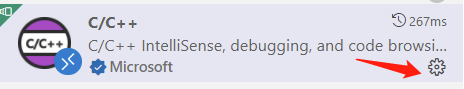
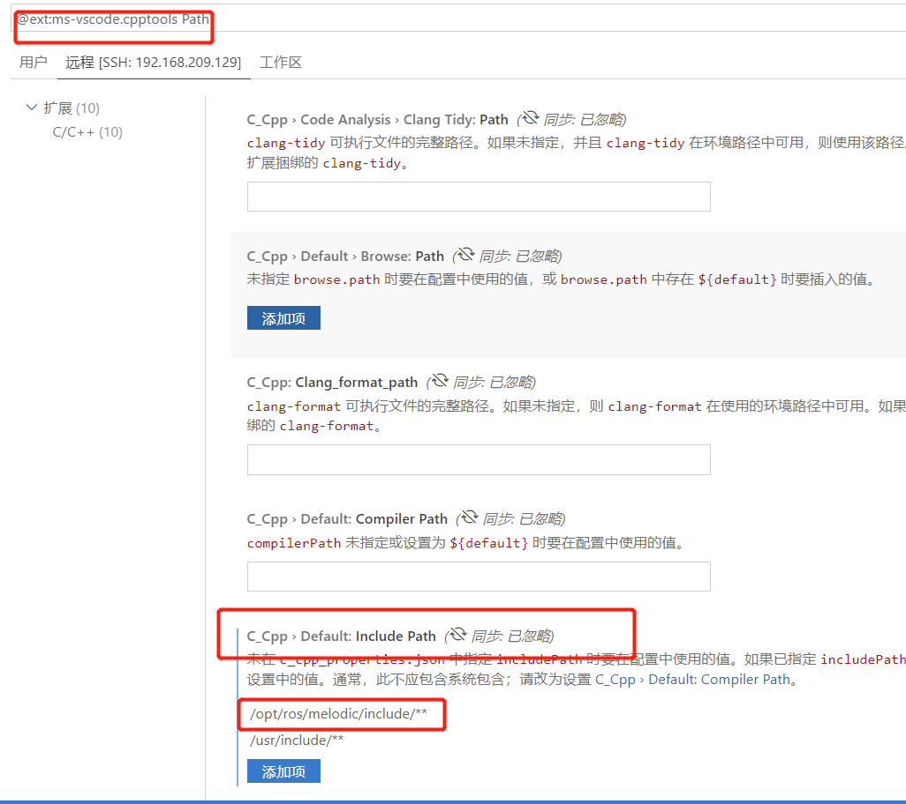

+++
title= "8_vscode适配"
description= "配置vscode"
date= 2022-05-23T22:18:10+08:00
author= "chao"
draft= false
image= "" 
math= true
categories= [
    "os"
]

tags=  [
    " ros"
]

+++

# 配置vscode

## 头文件智能提示

1. 进入c/c++插件

    

2. 配置头文件路径

         

    

## ros中文乱码问题

~~~c
  setlocale(LC_ALL,"");
~~~

## c_cpp_properties.json

~~~
{
    "configurations": [
        {
            "name": "linux",
            "includePath": [
                "/opt/ros/melodic/include",
                "/usr/include",
                "${workspaceFolder}/**",
                "${workspaceFolder}/devel/include"
            ],
            "intelliSenseMode": "linux-gcc-x64",
            "compilerPath": "/usr/bin/gcc",
            "cppStandard": "c++17",
            "cStandard": "c17"
        }
    ],
    "version": 4
}

~~~

