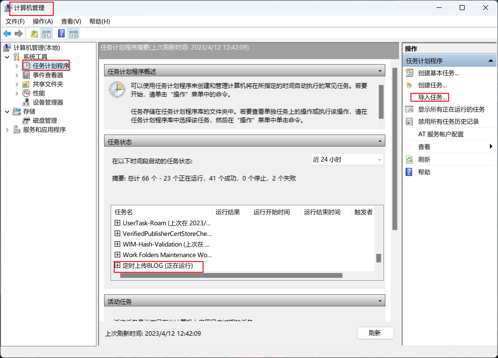
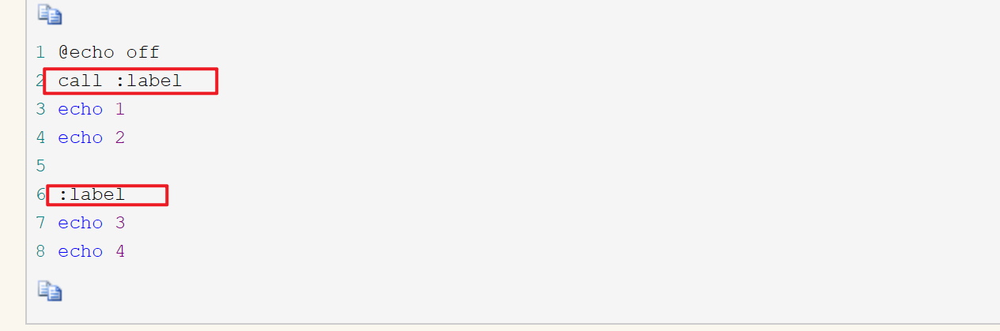
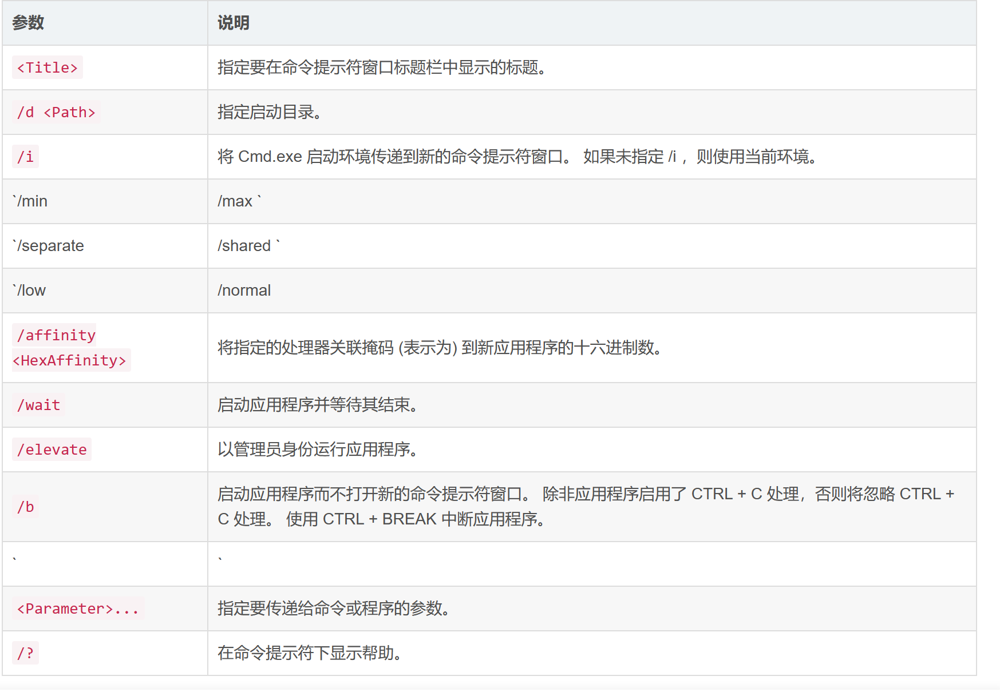
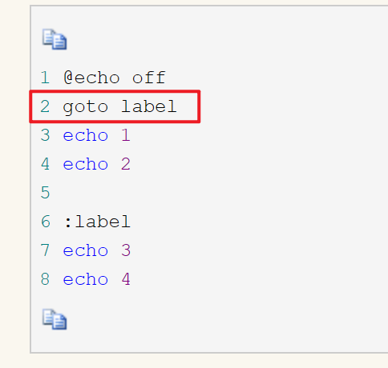

+++
title= "windows:一些好用的操作"
description= "文章简介"
date= 2023-04-12T11:58:49+08:00
author= "chao"
draft= false
image= "" 
math= true
categories= ["os"]

tags=  ["win "," "]

+++

# 一、定时任务

# 二、bat脚本

## 1. 基础命令

- echo

- rem

- pause

- call

  1.调用另一个批处理程序，并且不终止父批处理程序（如果不用call而直接调用别的批处理文件，那么执行完那个批处理文件后将无法返回当前文件并执行当前文件的后续命令）。

  2.调用标签

  

- start

  启动单独的命令提示符窗口以运行指定的程序或命令

  ~~~
  start [<Title>] [/d <Path>] [/i] [{/min | /max}] [{/separate | /shared}] [{/low | /normal | /high | /realtime | /abovenormal | belownormal}] 
  [/affinity <HexAffinity>] [/wait] [/elevate] [/b] [<Command> [<Parameter>... ] | <Program> [<Parameter>... ]]
  
  ~~~

  

  call与start的区别

  1. call调用不仅可以把参数或变量传给被调用的批处理，而且被调用的批处理也可以**设置参数或变量以便回传**，而start只能把参数或变量传给被调用的批处理，却**不能回传参数或变量**，这一点实际上是第二点的延伸

  

- goto

  call命令的应用示例2中，我们看到了call命令对跳转标签的调用，**注意调用时必须在标签名前加冒号，而goto是直接跟标签名**

  

- set

## 2.批处理符号简介

- 回显屏蔽 @

- 重定向1 >与>>

- 重定向2 <

- 管道符号 |

- 转义符 ^

- 逻辑命令符包括：`&、&&、||`

- 批处理参数%[1-9]

  > `%[1-9]`表示参数，参数是指在运行批处理文件时在文件名后加的以空格（或者Tab）分隔的字符串。变量可以从`%0`到`%9`，`%0`表示批处理命令本身，其它参数字符串用`%1`到`%9`顺序表示。

## 3.逻辑判断

### 3.1 if语句

形式

~~~
IF [NOT] ERRORLEVEL number command
IF [NOT] string1==string2 command
IF [NOT] EXIST filename command
~~~

1. 比较字符串&&比较数字

~~~
if [not] 信息比较表达式 (
   命令行1
) else (
   命令行2
)

案例
@echo off
if abc==ABC (
   echo abc euqal ABC
) else (
   echo abc not euqal ABC
)
pause>nul
~~~

2. 检测文件(夹)是否存在

~~~
if [not] exist filepath (
  命令行1
) else (
  命令行2
)

其中“exist”是关键字表示“存在”，“filepath”表示要判断的文件路径，如果检查到指定的文件存在则执行对应的命令块，“not”表示相反操作
@echo off
if exist C:\a.txt (
  echo file is find!
del C:\a.txt
) else (
  echo file is not found!
)
pause>nul
~~~

3. 检测变量是否被定义

   ~~~
   if defined 变量名 (
      命令行1
   ) else (
      命令行2
   )
   ~~~

   

4. 判断返回值(ERRORLEVEL)

~~~
表达式
if [not] ERRORLEVEL <number> <command> [else <expression>]
前一个指令的返回值判断， 大于等于则为true。

错误级别“errorlevel”是MS-DOS的内置环境变量，在上面已经介绍过，主要用于保存上一条命令语句是否执行成功，成功则返回0，失败或错误则返回相对应的错误级别码。然而“errorlevel”是内置环境变量，所以可以使用下面的方式判断：

案列：
if %errorlevel%==0 (
  echo success!
) else (
  echo failed!
)

然而“if”语句提供了一种特殊的错误级别判断方式，如下：
if [not] errorlevel number (
   命令行1
) else (
   命令行2
)
~~~

### 3.3 setlocal与endlocal命令

setlocal和endlocal命令执行结果：让中间的程序对于系统变量的改变只在程序内起作用，不会影响整个系统级别。

~~~
@echo off
setlocal
path=d:\
echo 局部环境变量path值
set path
endlocal
echo 系统环境变量path的值
set path
~~~

在第二行setlocal之后，第三行对于变量path进行了赋值，第四行就是显示一下该值。在第六行endlocal后，重新显示一下系统变量path（第七行），会发现仍然是程序运行之前的path值，没有被程序改变。