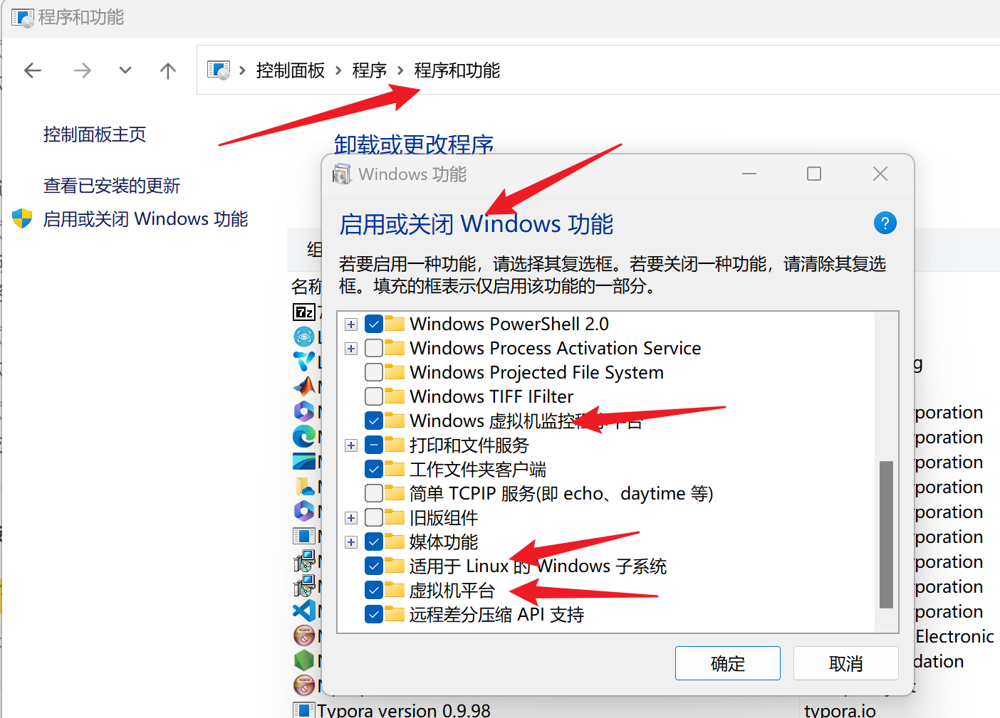
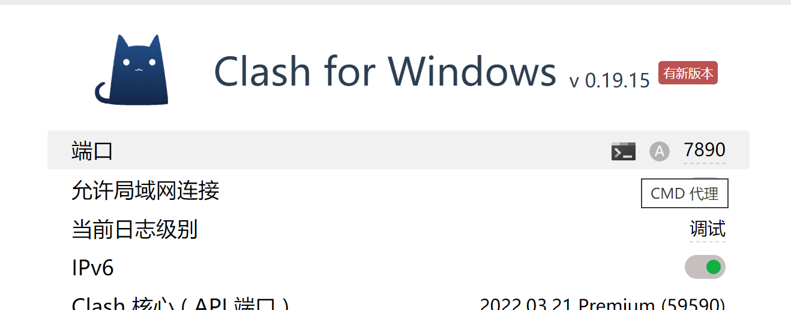

+++
title= "wsl：window下一款Linux环境"
description= "访问不了Google？git失败？"
date= 2022-03-23T20:09:16+08:00
author= "somebody"
draft= false
slug= "test-post"
image= "face.jpg" 
categories= [
    "os"
]

tags=  [
    " wsl"
]

+++

# 一、wsl与wsl2相互切换

## 1.开启windows相关功能

## 2.安装Windows升级软件

## 3.重启，然后“管理员终端”

~~~ shell
wsl --set-version <分发版名称 wsl -l -v 查看> 2或1
~~~

# 二、如何在wsl中使用网络代理？

wsl2需要在管理员终端，先开启windows防火墙权限

~~~
New-NetFirewallRule -DisplayName "WSL" -Direction Inbound  -InterfaceAlias "vEthernet (WSL)"  -Action Allow
~~~

打开clash的端口

代理端口设置

~~~
nano ~/.bashrc
#加入，其中7890为clash的代理端口

hostip=$(cat /etc/resolv.conf |grep -oP '(?<=nameserver\ ).*')
export https_proxy="http://${hostip}:7890"
export http_proxy="http://${hostip}:7890"
export all_proxy="socks5://${hostip}:7890"
~~~

# 三、WSL2中使用USB

[WSL2连接 USB 设备 - liu-huan - 博客园 (cnblogs.com)](https://www.cnblogs.com/huanliu/p/17161382.html)

1. 需要[Linux 内核 5.10.60.1 或更高版本](https://docs.microsoft.com/zh-cn/windows/wsl/kernel-release-notes)

2. uname -a查看版本号

3. 更新

   ~~~
   wsl --update
   ~~~

4. 安装 USBIPD-WIN 项目

   [连接 USB 设备 | Microsoft Learn](https://learn.microsoft.com/zh-cn/windows/wsl/connect-usb)