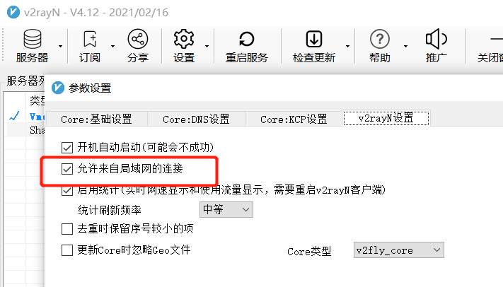

+++
title= "wsl：window下一款Linux环境"
description= "访问不了Google？git失败？"
date= 2022-03-23T20:09:16+08:00
author= "somebody"
draft= false
slug= "test-post"
image= "face.jpg" 
categories= [
    "os"
]

tags=  [
    " wsl"
]

+++

# 一、wsl与wsl2相互切换

## 1.开启windows相关功能


## 2.安装Windows升级软件


## 3.重启，然后“管理员终端”

~~~ shell
wsl --set-version <分发版名称 wsl -l -v 查看> 2或1
~~~


# 二、如何在wsl1中使用网络代理？

## 1. 代理工具

- polipo
- proxychain

## 2. 前提条件

v2ray中开启允许局域网连接



记住以下ip:port


## 3. 开始代理

### polipo

参考博客：[为 windows wsl 配置 socks5 代理 (github.com)](https://gist.github.com/moenn/2db47589724cf6c06ad9316ac57e2144)

步骤总结：

```
下载
sudo apt install polipo
打开配置文件
sudo nano /etc/polipo/config
写入
socksParentProxy = "localhost:10808"
socksProxyType = socks5
proxyPort = 8123

环境设置
nano ~/.bashrc
写入
export https_proxy=http://127.0.0.1:8123
export http_proxy=http://127.0.0.1:8123 
export all_proxy=socks5://127.0.0.1:8123

启动
sudo service polipo stop 
sudo service polipo start 

测试
curl www.google.com
```

### proxychain

参考博客：[linux下的全局代理工具proxychain | MonkeyWie's Blog](https://monkeywie.cn/2020/07/06/linux-global-proxy-tool-proxychain/)

