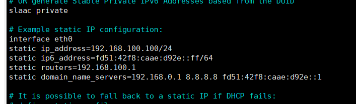

+++
title= "Raspberry系统初始配置操作"
description= "Raspberry系统初始配置操作"
date= 2022-04-30T13:21:57+08:00
author= "chao"
draft= false
image= "" 
math= true
categories= [
    "other"
]

tags=  [
    "command"
]

+++

# Raspberry系统初始配置操作

## 网络配置

###### 以太网固定

~~~shell
sudo nano /etc/dhcpcd.conf
~~~

取消相应的注释

~~~shell
interface wlan0
static ip_address=192.168.1.102/24
static ip6_address=fd51:42f8:caae:d92e::ff/64
static routers=192.168.1.1
static domain_name_servers=192.168.18.1 192.168.1.1 fd51:42f8:caae:d92e::1

interface eth0
static ip_address=192.168.1.181/24
static routers=192.168.1.1
static domain_name_servers=192.168.1.1
~~~

###### wifi连接

已经进入系统，联网情况下

~~~
//进入配置文件
sudo nano /etc/wpa_supplicant/wpa_supplicant.conf

//添加

network={
ssid="无线名称"

psk="无线密码"

}

~~~

没用进入到系统，boot中配置

boot盘中，新建文件，文件名为wpa_supplicant.conf,写入

~~~shell
country=CN
ctrl_interface=DIR=/var/run/wpa_supplicant GROUP=netdev
update_config=1

network={
ssid="无线名称"
psk="无线密码"
key_mgmt=WPA-PSK
priority=1
}
~~~

同上创建一个名字是ssh的文本文档，什么都不写，开启ssh服务

