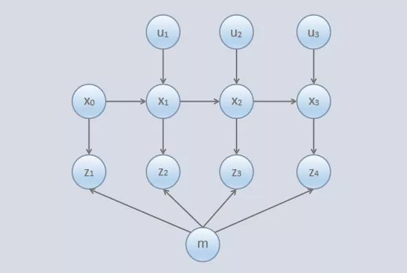
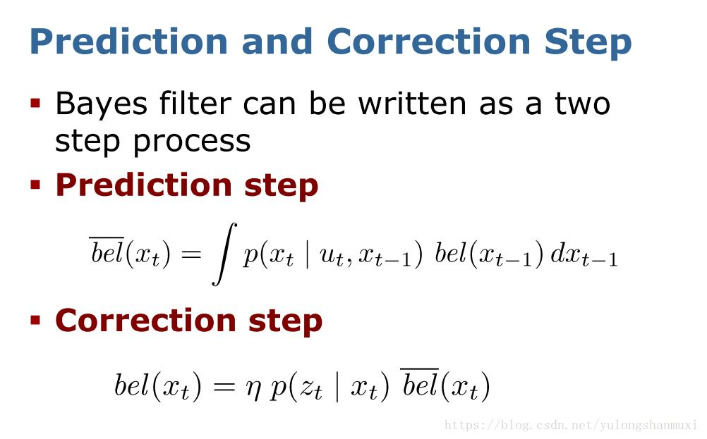
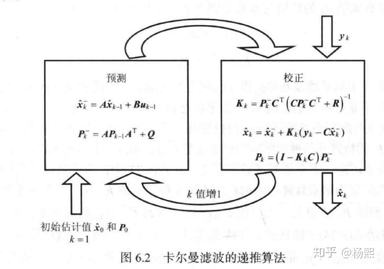

+++
title= "《概率机器人》-读书笔记"
description= "slam学习笔记"
date= 2022-03-31T01:05:24+08:00
author= "somebody"
draft= false
image= "" 
categories= [
    "robat"
]

tags=  [
    "slam","导航","book"
]

+++

# 概率机器人

##  1. 基础课程

### &emsp;1.1 概率论基础

- [概率论与数理统计基本概念](../../../math/probability/概率论学习之旅1/index.html)

### &emsp;1.2 随机过程

&emsp;&emsp; 随机过程可依其在任一时刻的状态是连续型随机变量或离散型随机变量而分成连续型随机过程和离散型随机过程.  
&emsp;&emsp; 定义：就是一个随"时间"演化的随机系统

##### &emsp;&emsp;学习参考课程和教材

- [随机过程-华中科技大学](https://www.bilibili.com/video/BV1g7411b7r2?spm_id_from=333.337.search-card.all.click)

*********************************

## 2. 贝叶斯滤波
&emsp;&emsp;贝叶斯滤波是卡尔曼滤波、粒子滤波的基础，应用到汽车、金融、航空航天、机器学习等行业。

> &emsp;&emsp;后验概率 = 标准似然度 *先验概率

&emsp;学习资料

- [理解贝叶斯滤波](https://zhuanlan.zhihu.com/p/139215491?msclkid=b2901ec8b5a211ec855d661246651d6d)

### &emsp;2.1 概率生成法则
- 初始置信度$p(x_{0})$

- 状态转移概率：$p(x_{t} |z_{t-1},u_{t})$

- 测量概率：$p(z_{t} |x_{t})$

- 状态转移概率和测量概率一起描述机器人及其环境组成的动态系统

  
### &emsp;2.2 置信度

- 置信度：反映机器人有关环境状态的内部信息。。
-  置信度用$bel(x_{t} )$表达，其为时刻t下状态$x_{t}$的概率分布的后验的缩写：$bel(x_{t} )=p(x_{t} |z_{1:t},u_{1:t})$表达，x表示状态。
- 预测：$\overline{bel(x_{t})}=p(x_{t} |z_{1: t-1},u_{1:t})$ 
- 修正：由$\overline{bel(x_{t})}$计算$bel(x_{t})$的过程。

### &emsp;2.3 贝叶斯滤波的过程

1. 预测
2. 修正

***********************

## 3.高斯滤波

- 高斯滤波是**递归状态估计器家族**的统称。

- 高斯滤波中的参数**均值（一阶矩）**和**方差（二阶矩）**称为**矩参数**。

  

### &emsp;3.1 卡尔曼滤波KF

- KF是由swerling和Kalman作为**线性高斯系统**中的预测和滤波技术而发明的，是用[**矩**](https://baike.baidu.com/item/矩/22856460?msclkid=20734877bb2e11eca50bc8ba69cbfee4)来定义的,它不适用于离散或混合状态空间。
- KF用矩参数表达置信度：在时刻t，**置信度用均值$\mu_{t} $ 和方差$\Sigma_{t}$表达**。

条件：除了贝叶斯滤波的马尔可夫假设，它还具有以下的三个特性，则后验就是高斯的

1. 状态转移概率必须是带有随机高斯噪声的参数的线性函数，如下式：  

   $$ x_{t}=A_{t}x_{t-1}+B_{t}u{t}+\varepsilon_{t}$$
   
2. 测量概率也与带有高斯噪声的自变量呈线性关系

   $$z_{t}=C_{t}x_{t}+\delta_{t}$$

3. 初始置信度$bel(x_{0})$必须是正态分布的。

   $$bel(x_{0})=p(x_{0})----x_{0}\sim N(\mu ,\Sigma _{0})$$

***卡尔曼滤波过程如下***：

****************

## 4.非参数滤波

### &emsp; 4.2 直方图滤波

### &emsp; 4.2 静态二值贝叶斯滤波

### &emsp; 4.3  粒子滤波(pf)

- 粒子滤波(particle filter)是贝叶斯滤波的另一种非参数实现。

- 粒子滤波以有限个参数来近似后验

- 主要思想：用一系列从后验得到的随机状态采样表示$bel(x_{t})$

- 一个粒子就是根据真实世界状态在时刻t的一个可能假设。

- 粒子滤波的直观感觉就是用粒子群$X_{t}$来近似置信度$bel(x_{t})$

  >
  >
  >理想情况下，状态假设$x_{t}$包含在粒子集$X_{t}$中的可能性与其贝叶斯滤波的后验$bel(x_{t})$成比例：
  >
  >$$x_{t}^{m}\sim p(x_{t}|z_{1:t},u_{1:t}) $$
  >
  >状态空间的一个子区域被样本填充得越密集，真实状态落入该区域的可能性越大

&emsp;&emsp;***粒子滤波算法由上一个时间步长的置信度$bel(x_{t-1})$递归地构建置信度$bel(x_{t})$,因为置信度由粒子集表示，这就意味粒子滤波可由粒子集$X_{t-1}$递归地构建粒子集$X_{t}$***

