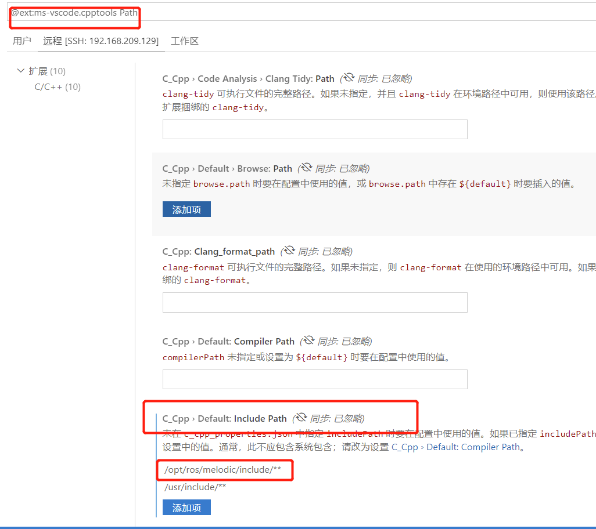
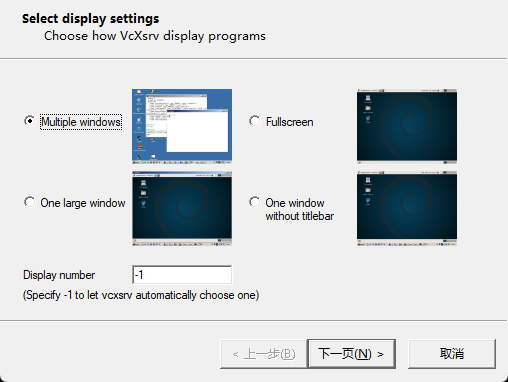
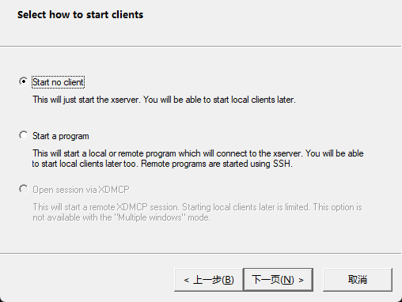
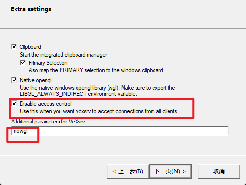
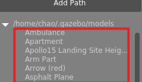

+++
title= "ROS的使用"
description= "如何安装ros"
date= 2022-04-01T13:25:02+08:00
author= "chao"
draft= false
image= "" 
categories= [
    "robot"
]

tags=  [
    "ros"
]
+++

# ROS的使用

##  一、安装ros

### 脚本安装
~~~
wget http://fishros.com/install -O fishros && sudo bash fishros
~~~
[原文章链接：鱼香ros](https://mp.weixin.qq.com/s/8hTrKL0N5y9i6s9ujhp0UA)

### rosdep 安装

> note: 注意安装ros过程中，可以不安装rosdep，它不是ros系统必须安装的，它的功能类似于ubuntu中的apt
>
> ，当我们安装ros的一些功能包的时候，也可以用apt安装，可以不用rosdep

[参考视频：小鱼在古月居开课视频--聊聊ROS安装过程中的那些坑](https://class.guyuehome.com/detail/p_61c588e1e4b0219857fdb40e/6)

## 二、ros的常用命令

###### 创建ros工作空间

~~~bash
 mkdir -p ~/catkin_ws/src
 
 cd ~/catkin_ws
 
 catkin_make

 source devel/setup.bash
 
 echo $ROS_PACKAGE_PATH
 
 echo "source /home/chao/Desktop/code/02c/ros1/src/devel/setup.bash" >> ~/.bashrc 
~~~

###### 创建ros程序包

~~~bash
cd ~/catkin_ws/src

catkin_create_pkg beginner_tutorials std_msgs rospy roscpp
~~~

###### ros参数命令

~~~shell
rosparam set     [param_name]       设置参数

rosparam get     [param_name]      获取参数

rosparam load    params.yaml       从文件中加载参数

rosparam dump 	 params.yaml  向文件中转储参数

rosparam delete  [param_name]      删除参数

rosparam list           列出参数名
~~~

## 三、ros的使用教程

#### 1. 发布者与订阅者

#### 2.服务器

#### 3.tf函数的使用

##### 安装

~~~shell
sudo apt install ros-melodic-turtle-tf
~~~

##### 可视化观测tf tree

~~~shell
#pdf
rosrun tf view_frames

#stdout
rosrun tf tf_echo node1 nodde2
~~~

##### 常用的tf坐标系

~~~
laser_link：激光雷达

base_link：车体

odom:里程计坐标系

map：单个机器人全局坐标系

earth：多个机器人协作
~~~

##### ros坐标转换的类

~~~
rosmsg info geometry_msgs/TransformStamped
~~~

##### geometry_msgs头文件内容

~~~
Accel.h                      
AccelStamped.h                
AccelWithCovariance.h         
AccelWithCovarianceStamped.h  
Inertia.h
InertiaStamped.h
Point32.h
Point.h
PointStamped.h
Polygon.h
PolygonStamped.h
Pose2D.h
PoseArray.h
Pose.h
PoseStamped.h
PoseWithCovariance.h
PoseWithCovarianceStamped.h
Quaternion.h                
QuaternionStamped.h          
Transform.h                  
TransformStamped.h     
Twist.h                
TwistStamped.h        
TwistWithCovariance.h
TwistWithCovarianceStamped.h  
Vector3.h
Vector3Stamped.h
Wrench.h
WrenchStamped.h
~~~

#####  1. geometry_msgs::TransformStamped

坐标系之间的关联信息

~~~
std_msgs/Header header
  uint32 seq
  time stamp
  string frame_id
string child_frame_id
geometry_msgs/Transform transform
  geometry_msgs/Vector3 translation
    float64 x
    float64 y
    float64 z
  geometry_msgs/Quaternion rotation
    float64 x
    float64 y
    float64 z
    float64 w
~~~

##### 2.geometry_msgs/PointStamped 

坐标点信息

~~~
std_msgs/Header header
  uint32 seq
  time stamp
  string frame_id
geometry_msgs/Point point
  float64 x
  float64 y
  float64 z
~~~

## 四、launch文件的使用

~~~xml
<?xml version="1.0"?>
<launch>
    
 	<include file="$(find pepperl_fuchs_r2000)/launch/r2000.launch"/>
 
 	<!--pkg:功能包名称(文件夹)  type：节点的可执行文件名称。name：运行节点名（优先级高于ros::init()中的参数）   -->
 	<node pkg="" type="" name="" output="screen"></node>
    
    
</launch>
~~~

## 五、VScode的配置

#### 头文件智能提示

1. 进入c/c++插件

    

2. 配置头文件路径

         

    

#### ros中文乱码问题

~~~c
  setlocale(LC_ALL,"");
~~~

#### c_cpp_properties.json

~~~
{
    "configurations": [
        {
            "name": "linux",
            "includePath": [
                "/opt/ros/melodic/include",
                "/usr/include",
                "${workspaceFolder}/**",
                "${workspaceFolder}/devel/include"
            ],
            "intelliSenseMode": "linux-gcc-x64",
            "compilerPath": "/usr/bin/gcc",
            "cppStandard": "c++17",
            "cStandard": "c17"
        }
    ],
    "version": 4
}

~~~

# xlaunch的使用

###### 1.安装VcXsrv

###### 2.解决wsl2 ping不通windows，而windows可以ping通wsl2

管理员终端设置防火墙

~~~
New-NetFirewallRule -DisplayName "WSL" -Direction Inbound  -InterfaceAlias "vEthernet (WSL)"  -Action Allow
~~~

###### 3.解决wsl每次重启之后IP地址都会重新配置和分配

~~~
nano ~/.bashrc

加入
#########display############
export LIBGL_ALWAYS_INDIRECT=0 #直接硬件渲染
export DISPLAY=$(awk '/nameserver / {print $2; exit}' /etc/resolv.conf 2>/dev/null):0
############################

source ~/.bashrc
~~~

4.xlaunch设置

参数-ac 等同 Disable access control的作用一样，允许所有客户端程序都能连接上这个VcXsrv

# gazebo使用

## 一、报错

运行gazebo报错libcurl: (51) SSL

~~~
nano ~/.ignition/fuel/config.yaml

把api.ignitionfuel.org换成 fuel.ignitionrobotics.org，然后保存退出
~~~

## 二、gazebo插件

~~~
cd ~/.gazebo && git clone git@github.com:osrf/gazebo_models.git

mv gazebo_models models
~~~

## 三、验证

