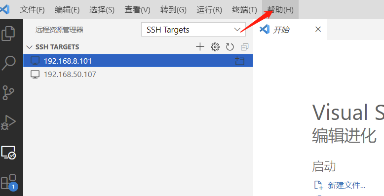

+++
title= "离线使用remote ssh"
description= "离线使用remote ssh"
date= 2022-05-10T13:38:58+08:00
author= "chao"
draft= false
image= "" 
math= true
categories= [
    "tools"
]

tags=  [
    " vscode"
]

+++

# 离线使用remote ssh

参考链接

[VS Code Server的离线安装过程 - 知乎 (zhihu.com)](https://zhuanlan.zhihu.com/p/294933020?msclkid=9372469cd01e11ec850ccb3fcb70049b)

## .vscode-server

### 准备工作

##### 下载安装包

1  确定vscode的commit id

点击帮助-->关于

2 观察并记录commit id 号

版本: 1.67.0 (system setup)
提交: 57fd6d0195bb9b9d1b49f6da5db789060795de47
日期: 2022-05-04T12:06:02.889Z
Electron: 17.4.1
Chromium: 98.0.4758.141
Node.js: 16.13.0
V8: 9.8.177.13-electron.0
OS: Windows_NT x64 10.0.19044

3 下载远程连接机器的安装包

~~~shell
用2中的内容替换${commit id}
#arm64
https://update.code.visualstudio.com/commit:${commit id}/server-linux-arm64/stable

#x64
https://update.code.visualstudio.com/commit:${commit id}/server-linux-x64/stable

#armhf
https://update.code.visualstudio.com/commit:${commit id}/server-linux-armhf/stable
~~~

## 安装工作

1 进入要连接的机器上，创建文件夹

~~~shell
mkdir -p $HOME/.vscode-server/bin
~~~

2 将下载包拷贝进$HOME/.vscode-server/bin目录下

3 解压

~~~shell
cd $HOME/.vscode-server/bin

tar -zxvf vscode-server-linux-armhf.tar.gz

rm -rf vscode-server-linux-armhf.tar.gz
~~~

4 重命名

~~~shell
mv vscode-server-linux-armhf ${commit id}

替换为具体的id

mv vscode-server-linux-armhf 57fd6d0195bb9b9d1b49f6da5db789060795de47
~~~

5 改权限

~~~shell
cd $HOME/.vscode-server/bin

chmod -R 775 ${commit id}
即
chmod -R 775 57fd6d0195bb9b9d1b49f6da5db789060795de47
~~~

6 连接

使用vscode远程连接

## other

如果需要插件，找到一个类似的机器，在上面联网安装，安装后的插件在$HOME/.vscode-server/extensions下，直接打包拷贝到离线机器人相同目录就可以了。

用win上的拷贝也可以

