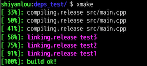
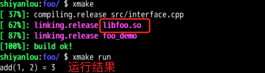

+++

title= "实验6目标依赖"
description= "蓝桥网课xmake笔记"
date= 2021-07-15T10:36:42+08:00
author= "chao"
draft= false
image= "" 
math= true

categories= [
    "tools"
]

tags=  [
    "xmake"
]

+++

# 实验6目标依赖

在本节实验中，我们会学习到如何控制多个程序的编译顺序，如何设置依赖来继承编译配置，以及动态库和静态库的编译使用。

#### 知识点

- 多个 C++ 程序间的编译顺序控制
- 依赖编译的配置继承
- 动态库、静态库的编译和使用
- Phony 组合多个编译目标程序


## 多目标程序的依赖编译

在默认情况下，xmake 在编译多个目标程序时，会通过多任务并行编译来提升项目的整体编译效率，不过每个 target 目标程序实际的编译顺序是未定义的。

然而有时候，某些项目工程中的多个目标程序之间是有依赖关系的，如果不控制编译顺序，那么有可能会错误地优先编译一些需要滞后的程序，就会导致编译出错。

这种情况下通过 `add_deps()` 配置接口去控制指定 target 的编译依赖顺序，对一些依赖静态库、动态库的可执行程序非常有用。

#### 链接和编译的依赖控制

为了了解如何使用 `add_deps` 来控制编译依赖顺序，我们先重新创建个 `deps_test` 的空工程。

```bash
cd ~/Code
xmake create deps_test
```

然后修改 deps_test/xmake.lua 配置。

```lua
target("test1")
    set_kind("binary")
    add_files("src/*.cpp")
    add_deps("test2")

target("test2")
    set_kind("binary")
    add_files("src/*.cpp")
    add_deps("test3")

target("test3")
    set_kind("binary")
    add_files("src/*.cpp")
```

上述配置，我们使用 `add_deps` 将三个 target 目标程序的依赖顺序调整为：test1 依赖 test2， test2 依赖 test3。

那么执行编译的时候的，test3 会优先编译，然后是编译 test2，最后才编译 test1。

执行 `xmake` 查看实际的编译顺序。



通过上图，我们可以看到最后三个程序的实际链接顺序确实已经按照刚刚设置的依赖顺序进行执行了，不过其 C++ 源文件还是在最开始就执行编译了。

这是由于 xmake 要优化编译速度，在编译链接时候，假定一个事实，那就是所有不同目标的 C/C++ 源文件之间是不需要依赖顺序的，我们完全可以全部并行化处理编译。

仅仅只有在链接阶段才需要处理依赖顺序，这样我们可以最大化的将大量源码的编译全部并行化，而不是编译链接完成一个 target，再去实际处理第二个 target 程序的源码编译和链接，这会在每个 target 的链接阶段导致一段时间的串行化和停滞，减慢编译速度。

简单来说，也就是即使设置 `add_deps`，xmake 默认也仅仅控制链接的依赖顺序，不控制源码编译的依赖顺序。

不过，万事总有例外，如果程序确实还是需要每个 target 的源码都要严格按照 `add_deps` 指定的依赖顺序去控制编译，那么我们只需要设置下编译策略，禁用跨目标并行编译即可，例如下面的配置。

```lua
set_policy("build.across_targets_in_parallel", false)

target("test1")
    set_kind("binary")
    add_files("src/*.cpp")
    add_deps("test2")

target("test2")
    set_kind("binary")
    add_files("src/*.cpp")
    add_deps("test3")

target("test3")
    set_kind("binary")
    add_files("src/*.cpp")
```

我们通过全局设置禁用 `build.across_targets_in_parallel` 策略，就可以完全串行化 target 间的源码编译顺序，不再跨目标并行编译源码。

由于实际源码和配置没有发生改变，默认的 `xmake` 编译命令不会触发重新编译，所以我们通过执行 `xmake -r` 强制重新编译，来直观感受下禁用这个策略后的效果。


可以对比下上图的编译顺序跟之前的编译顺序，还是有明显区别的，这次我们不仅链接顺序，甚至连源码也都严格按照 test3，test2，test1 的顺序来编译了，test1 的源码必须要等待 test2 实际完成链接后才会去编译。

#### 静态库的依赖编译和继承

了解了依赖顺序的控制后，接下来开始重点讲解如何实现静态库和可执行程序的组合编译，通常我们开发一个静态库程序，都会同时写一个可执行程序去链接并使用库里面的接口。

这个时候，如果我们使用 `add_links` 和 `add_linkdirs` 去链接依赖的静态库就会比较繁琐，既然这两者之间原本就是有依赖关系的，那么我们可以在配置 `add_deps` 后，通过可执行程序去自动集成对应的静态库的链接信息来简化配置。

整个简化流程大概如下图所示，通过配置 `add_deps` 可以集成依赖的静态库目标程序中的大部分链接信息，因此仅仅只需要通过关联依赖，就能够自动集成和使用静态库。


我们可以通过 xmake 提供的模板工程创建一个带有静态库的空工程，里面默认就提供了两个 target 目标程序，一个静态库和一个可执行程序。

```bash
cd Code
xmake create -t static foo
```

foo/xmake.lua 配置内容如下。

```lua
target("foo")
    set_kind("static")
    add_files("src/interface.cpp")

target("foo_demo")
    set_kind("binary")
    add_deps("foo")
    add_files("src/main.cpp")
```

其中 foo 就是静态库目标程序，而 foo_demo 是可执行目标程序，它们之间通过 `add_deps("foo")` 进行依赖关联，使得 foo_demo 可以自动集成 foo 静态库，而不再需要额外添加 `add_linkdirs`、`add_links` 等配置信息。

#### 依赖配置的可见性设置

`add_deps` 除了能够自动继承静态库依赖的链接信息，还可以继承一些其它的配置信息，比如：`add_includedirs`、`add_defines` 等大部分配置都是可以被继承的。

不过只有这些配置被设置了 `public`、`interface` 等对外可见性设置，才能够支持对其它 target 导出配置被继承。

比如我们将 foo/xmake.lua 改为下面的配置，来进一步导出 foo 库的一些头文件搜索路径和宏定义。

```lua
target("foo")
    set_kind("static")
    add_files("src/interface.cpp")
    add_defines("TEST", {public = true})
    add_includedirs("src", {interface = true})

target("foo_demo")
    set_kind("binary")
    add_deps("foo")
    add_files("src/main.cpp")
```

通过设置 `{public = true}` 将 `-DTEST` 的宏定义设置公开给其它依赖的子 target 继承，并且 foo 自身也会被定义。

而 `add_includedirs("src", {interface = true})` 会把 src 作为头文件搜索目录，以接口的方式仅仅开放给其它 target 继承，而 foo 自身不会去设置它。

关于可见性，xmake 主要提供下面三种，默认情况下的配置都是私有的，不对外可见的。

| 属性      | 描述                                                         |
| --------- | ------------------------------------------------------------ |
| private   | 默认设置，作为当前 target 的私有配置，不会被依赖的其它 target 所继承 |
| public    | 公有配置，当前 target 依赖的子 target 都会被设置             |
| interface | 接口设置，仅被依赖的子 target 所继承设置，当前 target 不参与 |

执行 `xmake -rv` 命令编译输出查看实际的继承效果，其中 `-DTEST` 应该会同时设置到 foo 和 foo_demo 的所有源文件编译，而 `-Isrc` 会仅仅被设置到 foo_demo 的源文件编译。


#### 级联依赖继承

接下来，我们再来尝试下更加复杂的场景，将依赖继承的层级加深一层，foo_demo 依赖 foo 静态库，而 foo 依赖 bar 静态库，并且我们把额外的 public 导出配置放置到 bar 目标程序中，比如下面这样。

```lua
target("bar")
    set_kind("static")
    add_files("src/interface.cpp")
    add_defines("TEST", {public = true})
    add_includedirs("src", {interface = true})

target("foo")
    set_kind("static")
    add_files("src/interface.cpp")
    add_deps("bar")

target("foo_demo")
    set_kind("binary")
    add_deps("foo")
    add_files("src/main.cpp")
```

这个时候，xmake 在编译最终的 foo_demo 时候，也会自动继承 foo 和 bar 里面的静态库信息，并且继承上 public 和 interface 的导出配置，也就是说 `add_deps` 的继承是完全支持级联依赖的，实际效果见下图。


## 动态库的依赖编译

除了静态库，我们也可以通过依赖继承的方式将动态库和可执行程序进行关联，只需要把之前的 xmake.lua 里面的 foo 目标类型改成 shared，就能编译生成动态库，并且自动关联上可执行程序。

我们改成下面的配置。

```lua
target("foo")
    set_kind("shared")
    add_files("src/interface.cpp")
    add_defines("TEST", {public = true})
    add_includedirs("src", {interface = true})

target("foo_demo")
    set_kind("binary")
    add_deps("foo")
    add_files("src/main.cpp")
```

然后执行编译运行。

```bash
xmake
xmake run
```

xmake 会生成一个 `libfoo.so` 动态库程序，然后 foo_demo 会自动链接上这个 so 库，然后运行的时候，也能够自动加载上它。



至于为什么能够自动加载上编译生成的 so 库，那是因为通过 `add_deps("foo")` 配置的依赖继承关系，在 foo_demo 链接的时候，除了自动加了 `-Lxx -lfoo` 等链接信息外，还额外追加了 rpath 信息用来设置动态库的加载路径信息，也就是下图红框中的 `-Wl,-rpath=$ORIGIN`。

这个链接选项的意思就是配置可执行程序运行时，可以搜索当前运行目录下的所有依赖的 so 库，如果存在就可以正常加载这些 so 库。


另外，从上图中我们看到 `-DTEST -Isrc` 等 public 导出配置也同样被继承了进来。

#### 使用 Phony 目标组合多个依赖程序

在之前的实验中我们讲到 target 的基础目标类型，除了 `binary`、`static` 和 `shared` 之外，还有一个特殊的目标类型 `phony`，它用于设置给定 target 作为一个空的目标对象，并不会参与实际的源码编译。

虽然不会参与实际编译，但是它可以和 `add_deps` 配合使用，用来组合一些需要一起编译的几个 target，实现一组 target 目标同时编译。

我们再来继续修改 xmake.lua，将 group 目标设置成 phony 目标类型，本身不参与编译，但是通过 `add_deps("foo", "bar")` 关联上 foo 和 bar 这两个目标程序，相当于将它们组合到一起同时被 group 目标依赖，例如。

```lua
target("foo")
    set_kind("binary")
    add_files("src/*.cpp")

target("bar")
    set_kind("binary")
    add_files("src/*.cpp")

target("baz")
    set_kind("binary")
    add_files("src/*.cpp")

target("group")
    set_kind("phony")
    add_deps("foo", "bar")
```

因此，我们只需要执行 `xmake build group` 指定编译 group 目标，就会触发 foo 和 bar 这两个程序的编译，而 bar 目标由于没有被依赖，所以就不会被编译。

编译后的实际结果如下图。


## 实验总结

在本节实验中，我们主要学习了如何去设置依赖编译来控制多个目标程序的编译顺序，也学会了如何去继承其它目标程序导出的配置以及如何去编译使用动态库、静态库程序。

本实验的参考代码可以使用如下命令下载：

```bash
wget https://labfile.oss.aliyuncs.com/courses/2764/code6.zip
```